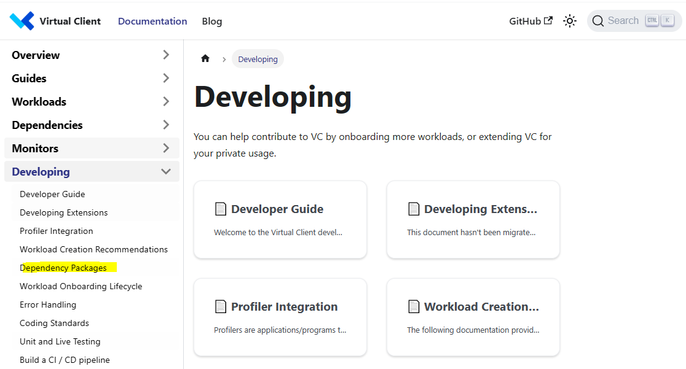
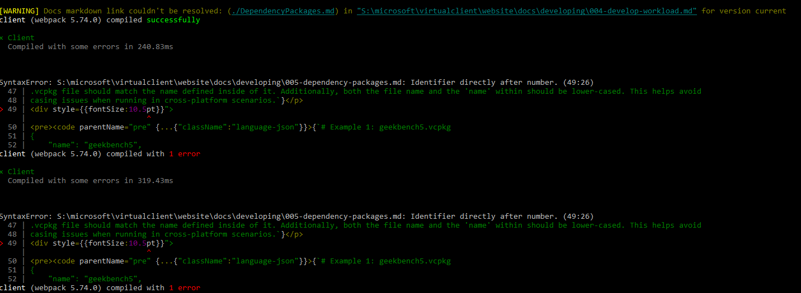
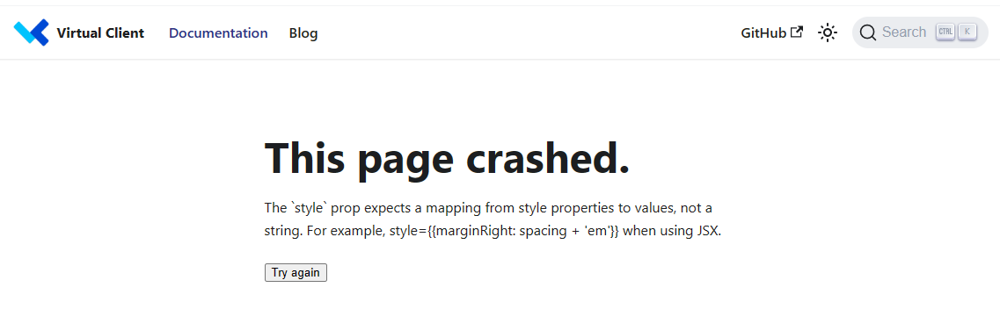

# Docusaurus Integration
This repo uses a software called 'Docusaurus' in order to create a structured documentation website for Virtual Client information. The sections below
provide information on Docusaurus including any requirements or expected practices as they apply to this repo.

## Resources
The following links provide additional resources related to Docusaurus. These can be helpful references when writing documentation in the repo.

* [Docusaurus Documentation](https://docusaurus.io/docs/)
* [Docusaurus Markdown Features](https://docusaurus.io/docs/markdown-features)
* [Docusaurus Page Display Order](https://docusaurus.io/docs/sidebar/autogenerated)

## Document Naming Conventions
Documents in the repo 'website/docs' location follow a specific naming convention in order to provide support for features of Docusaurus as well as for
other applications (e.g. vscode). The following section describes how documentation files should be named for best integration with Docusaurus.

- Files should have a thousands-based numeric prefix (e.g. 0001-documentation-file.md).

- Consecutive numeric prefixes should be separated by at least 10 numeric spots (e.g. 0001, 0010, 0020, 0030,..., 0100).

- Files should be named using the numeric prefix so that they are ordered on the file system in the way they should display on the Docusaurus site. Docusaurus
  uses the numeric prefixes to determine ordering and it is ideal (in terms of maintenance) that the files display order is visually obvious.
  ```
  /repo/website/docs/anyfolder/0001-document-1.md
  /repo/website/docs/anyfolder/0010-document-2.md
  /repo/website/docs/anyfolder/0020-document-3.md
  /repo/website/docs/anyfolder/0030-document-4.md
   ...
  /repo/website/docs/anyfolder/0100-document-n.md
  ```

## Folder Naming Conventions


## Building the Docusaurus Site
This section covers how to build the docusaurus site for the repo to ensure that there are no warnings and errors before submitting documentation changes
to the repo.

### Install the Toolsets
Docusaurus uses Node.js and a few different Javascript based toolsets available via NPM to build and run the site. Install the toolsets described in the
documentation. Note that some of the links involve creating scaffolding for the website. You will not need to create scaffolding as this repo already has
a fully laid-out docusaurus site. We are simply attempting to build and potentially run the website from our local system.

* [Install Docusaurus](https://docusaurus.io/docs/installation)
  * Install [Node.js](https://nodejs.org/en/download/)

  * Install packages from NPM for the site.
  ```
  # Given the root directory for the repo is S:\microsoft\virtualclient. This will install
  # the packages as defined in the package.json file in the 'website' directory...standard
  # NPM package stuff! You will see a 'node_modules' folder in the 'website' directory afterwards.
  S:\microsoft\virtualclient\website> npm install
  ```

### Build the Docusaurus Site
After installing the required toolsets, you can build the Docusaurus documentation site for the repo. The following examples illustrate how to do this.
Note that if you see warnings or errors in the build output, you can get more information on the error by running the site. Errors are displayed in the 
browser when you select the page in error. See the section below for details on how to run (and browse) the site locally.

```
# Given the root directory for the repo is S:\microsoft\virtualclient.
S:\microsoft\virtualclient\website> npm run build
```

### Run the Docusaurus Site
After installing the required toolsets, you can build the Docusaurus documentation site for the repo. The following examples illustrate how to do this.

```
# Given the root directory for the repo is S:\microsoft\virtualclient.
S:\microsoft\virtualclient\website> npm run start
```

### Finding Errors
As noted in the section above on building the Docusaurus  documentation site, running the site can help you identify issues in any of the documents that
are causing build warnings and errors.

* **Run the site**  
  

* **Errors will be displayed on the console windows**  
  

* **Errors will be displayed in the browser**  
  
