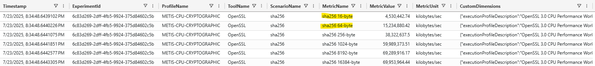
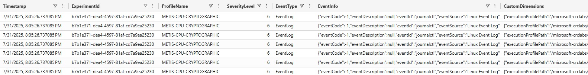

# Data/Telemetry Support
The Virtual Client emits a range of different types of data/telemetry as part of the execution of workload and monitoring
profiles. This data/telemetry might for example include measurements/metrics emitted by a particular workload, performance counters
or just common tracing/logging output. This data is useful for using the Virtual Client as a platform for evaluating performance
of a system while under test.

## Categories of Data
Telemetry data emitted is divided into 3 different categories:

* **Logs/Traces**  
  The Virtual Client is heavily instrumented with structured logging/tracing logic. This ensures that the inner workings of the application can
  are easily visible to the user. This is particularly important for debugging scenarios. Errors experienced by the application are captured here
  as well and will contain detailed error + callstack information.

  **Workload and System Metrics**  
  Workload metrics are measurements and information captured from the output of a particular workload (e.g. DiskSpd, FIO, GeekBench) that represent
  performance data from the system under test. Performance counters for example provide measurements from the system as-a-whole and are useful for determining exactly how the resources (e.g. CPU, memory, I/O, network)
  were used during the execution of a workload.

  **System Events**  
  System events describe certain types of important information on the system beyond simple performance measurements. This might for example
  include Windows registry changes or special event logs.

## Metadata Contract
Within the different categories of data emitted by the Virtual Client (as noted above), the Virtual Client includes a range of different metadata about the
system and runtime context as it runs. This "metadata contract" is divided into a few different categories of metadata by default. The following section describes
those categories and illustrates examples of the structure of the telemetry messages emitted.

* **User-Defined Metadata**
  Metadata that is supplied by the user on the command line (e.g. --metadata:Prop1=Value1) will be included in the output of telemetry within the "metadata" section
  of the telemetry structure.

* **Dependency Metadata**  
  Dependency metadata describes different dependencies that were required/used during the execution of the Virtual Client. This information might for example include packages
  that were downloaded or installed on the system.

* **Host/OS Metadata**  
  Host metadata includes information about the host, the operating system and the hardware for the system in which Virtual Client is running. This information is included in the 
  "metadata_host" section of the telemetry structure.

* **Runtime Metadata**  
  Runtime metadata describes the instructions provided to the Virtual Client on the command line and aspects that are specific to the running instance of the application.
  This information is included in the "metadata_runtime" section of the telemetry structure.

* **Scenario Metadata**
  Scenario metadata is information specific to a given component within a Virtual Client profile. This might include the parameters for a action, monitor or dependency component.
  It might include installed compiler versions, the names of tools executed and their command line arguments or supplemental information in the context of a workload that is running.
  Developers onboarding components to the Virtual Client have the option to add additional scenario-specific metadata as is desirable to provide rich context to the 
  execution of workloads and monitors.

  *Example Metadata/Telemetry from Physical System*  
  ``` json
  {
    "timestamp": "2023-08-07T17:52:51.6630597Z",
    "level": "Information",
    "message": "OpenSSL.ScenarioResult",
    "customDimensions": {
        "appPlatformVersion": "1.6.0.0",
        "appVersion": "1.6.0.0",
        "clientId": "longrun",
        "executionProfileName": "PERF-CPU-OPENSSL.json",
        "executionProfilePath": "S:\\Debug\\PERF-CPU-OPENSSL.json",
        "executionSystem": null,
        "experimentId": "dbd29735-589d-4f15-adc7-2f1ec3991f03",
        "metricCategorization": "",
        "metricDescription": "",
        "metricMetadata": {},
        "metricName": "md5 16-byte",
        "metricRelativity": "HigherIsBetter",
        "metricUnit": "kilobytes/sec",
        "metricValue": 39359.36,
        "platformArchitecture": "win-x64",
        "scenarioArguments": "S:\\VirtualClient\\content\\win-x64\\packages\\openssl.3.0.0\\win-x64\\bin\\openssl.exe speed -elapsed -seconds 100 md5",
        "scenarioEndTime": "2023-08-08T00:52:51.6232956Z",
        "scenarioName": "OpenSSL Speed",
        "scenarioStartTime": "2023-08-08T00:52:21.4592999Z",
        "tags": "CPU,OpenSSL,Cryptography",
        "toolName": "OpenSSL",
        "toolVersion": "",
        "metadata": {
            "experimentId": "dbd29735-589d-4f15-adc7-2f1ec3991f03",
            "agentId": "LONGRUN"
        },
        "metadata_dependencies": {
            "package_openssl": "openssl.3.0.0.zip"
        },
        "metadata_host": {
            "computerName": "LONGRUN",
            "cpuArchitecture": "X64",
            "cpuSockets": 1,
            "cpuPhysicalCores": 4,
            "cpuPhysicalCoresPerSocket": 4,
            "cpuLogicalProcessors": 8,
            "cpuLogicalProcessorsPerCore": 8,
            "cpuCacheBytes_L1d": 131072,
            "cpuCacheBytes_L1i": 131072,
            "cpuCacheBytes_L1": 262144,
            "cpuCacheBytes_L2": 1048576,
            "cpuCacheBytes_L3": 8388608,
            "cpuLastCacheBytes": 8388608,
            "memoryBytes": 17179869184,
            "numaNodes": 0,
            "osFamily": "Windows",
            "osName": "Windows",
            "osDescription": "Microsoft Windows NT 10.0.19045.0",
            "osVersion": "10.0.19045.0",
            "osPlatformArchitecture": "win-x64",
            "parts": [
                {
                    "type": "CPU",
                    "vendor": "Intel",
                    "description": "Intel64 Family 6 Model 142 Stepping 11, GenuineIntel",
                    "family": "6",
                    "model": "Intel(R) Core(TM) i7-8565U CPU @ 1.80GHz",
                    "stepping": "11",
                },
                {
                    "type": "Memory",
                    "vendor": "SK Hynix",
                    "description:": "SK Hynix HMA81GS6JJR8N-VK"
                    "bytes": 8589934592,
                    "speed": 2400,
                    "partNumber": "HMA81GS6JJR8N-VK"
                },
                {
                    "type": "Memory",
                    "vendor": "SK Hynix",
                    "description:": "SK Hynix HMA81GS6JJR8N-VK"
                    "bytes": 8589934592,
                    "speed": 2400,
                    "partNumber": "HMA81GS6JJR8N-VK"
                },
                {
                    "type": "Network",
                    "vendor": "Intel",
                    "description": "Intel(R) Wireless-AC 9560 160MHz"
                },
                {
                    "type": "Network",
                    "vendor": "Realtek",
                    "description": "Realtek PCIe GBE Family Controller"
                }
            ]
        },
        "metadata_runtime": {
            "exitWait": "00:30:00",
            "layout": null,
            "logToFile": false,
            "iterations": 2,
            "profiles": "PERF-CPU-OPENSSL.json",
            "timeout": null,
            "timeoutScope": null,
            "scenarios": null
        },
        "metadata_scenario": {
            "scenario": "MD5",
            "packageName": "openssl",
            "extract": "True",
            "monitorFrequency": "12:00:00",
            "monitorWarmupPeriod": "00:05:00",
            "commandArguments": "speed -elapsed -seconds 100 md5",
            "tags": "CPU,OpenSSL,Cryptography",
            "profileIteration": 1,
            "profileIterationStartTime": "2023-08-08T00:52:20.7673266Z",
            "toolName": "OpenSSL Speed",
            "toolArguments": "S:\\VirtualClient\\content\\win-x64\\packages\\openssl.3.0.0\\win-x64\\bin\\openssl.exe speed -elapsed -seconds 100 md5",
            "toolVersion": null,
            "packageVersion": "3.0.0"
        }
    }
  }
  ```

  *Example Metadata/Telemetry from Physical System*  
  ``` json
  {
    "timestamp": "2023-08-07T17:52:51.6630597Z",
    "level": "Information",
    "message": "OpenSSL.ScenarioResult",
    "customDimensions": {
        "appPlatformVersion": "1.6.0.0",
        "appVersion": "1.6.0.0",
        "clientId": "longrun",
        "executionProfileName": "PERF-CPU-OPENSSL.json",
        "executionProfilePath": "S:\\Debug\\PERF-CPU-OPENSSL.json",
        "executionSystem": null,
        "experimentId": "dbd29735-589d-4f15-adc7-2f1ec3991f03",
        "metricCategorization": "",
        "metricDescription": "",
        "metricMetadata": {},
        "metricName": "md5 16-byte",
        "metricRelativity": "HigherIsBetter",
        "metricUnit": "kilobytes/sec",
        "metricValue": 39359.36,
        "platformArchitecture": "win-x64",
        "scenarioArguments": "/home/user/VirtualClient/packages/openssl.3.0.0/linux-x64/bin/openssl speed -multi 4 -elapsed -seconds 100 md5",
        "scenarioEndTime": "2023-08-08T00:52:51.6232956Z",
        "scenarioName": "OpenSSL Speed",
        "scenarioStartTime": "2023-08-08T00:52:21.4592999Z",
        "tags": "CPU,OpenSSL,Cryptography",
        "toolName": "OpenSSL",
        "toolVersion": "",
        "metadata": {
            "experimentId": "dbd29735-589d-4f15-adc7-2f1ec3991f03",
            "agentId": "LONGRUN"
        },
        "metadata_dependencies": {
            "package_openssl": "openssl.3.0.0.zip"
        },
        "metadata_host": {
            "computerName": "Linux-Host",
            "osFamily": "Unix",
            "osName": "Ubuntu",
            "osDescription": "Unix 4.15.0.140",
            "osVersion": "4.15.0.140",
            "osPlatformArchitecture": "linux-x64",
            "cpuArchitecture": "X64",
            "cpuSockets": 1,
            "cpuPhysicalCores": 4,
            "cpuPhysicalCoresPerSocket": 4,
            "cpuLogicalProcessors": 4,
            "cpuLogicalProcessorsPerCore": 4,
            "numaNodes": 1,
            "cpuCacheBytes_L1d": 32768,
            "cpuCacheBytes_L1i": 32768,
            "cpuCacheBytes_L1": 65536,
            "cpuCacheBytes_L2": 2097152,
            "cpuLastCacheBytes": 2097152,
            "memoryBytes": 8589934592,
            "parts": [
                {
                    "type": "CPU",
                    "vendor": "AMD",
                    "description": "AMD A8-7410 APU with AMD Radeon R5 Graphics Family 22 Model 48 Stepping 1, AuthenticAMD",
                    "family": "22",
                    "model": "AMD A8-7410 APU with AMD Radeon R5 Graphics",
                    "stepping": "1",
                },
                {
                    "type": "Memory",
                    "vendor": "Micron",
                    "description": "Micron, 16KTF1G64HZ-1G9P1",
                    "bytes": 8589934592,
                    "speed": 1866,
                    "partNumber": "16KTF1G64HZ-1G9P1"
                },
                {
                    "type": "Network",
                    "vendor": "Realtek",
                    "description": "Realtek Semiconductor Co., Ltd. RTL8188EE Wireless Network Adapter (rev 01)"
                },
                {
                    "type": "Network",
                    "vendor": "Realtek",
                    "description": "Realtek Semiconductor Co., Ltd. RTL810xE PCI Express Fast Ethernet controller (rev 07)"
                }
            ]
        },
        "metadata_runtime": {
            "exitWait": "00:30:00",
            "layout": null,
            "logToFile": false,
            "iterations": 2,
            "profiles": "PERF-CPU-OPENSSL.json",
            "timeout": null,
            "timeoutScope": null,
            "scenarios": null
        },
        "metadata_scenario": {
            "scenario": "MD5",
            "packageName": "openssl",
            "extract": "True",
            "monitorFrequency": "12:00:00",
            "monitorWarmupPeriod": "00:05:00",
            "commandArguments": "speed -elapsed -seconds 100 md5",
            "tags": "CPU,OpenSSL,Cryptography",
            "profileIteration": 1,
            "profileIterationStartTime": "2023-08-08T00:52:20.7673266Z",
            "toolName": "OpenSSL Speed",
            "toolArguments": "/home/user/VirtualClient/packages/openssl.3.0.0/linux-x64/bin/openssl speed -multi 4 -elapsed -seconds 100 md5",
            "toolVersion": null,
            "packageVersion": "3.0.0"
        }
     }
  }
  ```

  *Example Metadata/Telemetry from Virtual Machine System*  
  ``` json
  {
    "timestamp": "2023-08-10T22:34:41.4831010Z",
    "level": "Information",
    "message": "OpenSSL.ScenarioResult",
    "customDimensions": {
        "appPlatformVersion": "0.0.1.0",
        "appVersion": "1.7.02377.1059",
        "clientId": "demo-vm02",
        "executionProfileName": "PERF-CPU-OPENSSL.json",
        "executionProfilePath": "/home/junovmadmin/VirtualClient/content/linux-x64/profiles/PERF-CPU-OPENSSL.json",
        "executionSystem": null,
        "experimentId": "416dccea-1745-4c13-9a5d-558e87aea533",
        "metricCategorization": "",
        "metricDescription": "",
        "metricMetadata": {},
        "metricName": "md5 256-byte",
        "metricRelativity": "HigherIsBetter",
        "metricUnit": "kilobytes/sec",
        "metricValue": 468409.66,
        "platformArchitecture": "linux-x64",
        "scenarioArguments": "speed -multi 2 -elapsed -seconds 100 md5",
        "scenarioEndTime": "2023-08-10T22:34:41.4631165Z",
        "scenarioName": "OpenSSL Speed",
        "scenarioStartTime": "2023-08-10T22:24:41.4456628Z",
        "tags": "CPU,OpenSSL,Cryptography",
        "toolName": "OpenSSL",
        "toolResults": "",
        "toolVersion": "",
        "metadata": {
            "experimentId": "416dccea-1745-4c13-9a5d-558e87aea533",
            "agentId": "demo-vm02"
        },
        "metadata_dependencies": { 
            "package_openssl": "openssl.3.0.0.zip"
        },
        "metadata_host": {
            "computerName": "demo-vm02",
            "osFamily": "Unix",
            "osName": "Ubuntu",
            "osDescription": "Unix 5.15.0.1041",
            "osVersion": "5.15.0.1041",
            "osPlatformArchitecture": "linux-x64",
            "cpuArchitecture": "X64",
            "cpuSockets": 1,
            "cpuPhysicalCores": 1,
            "cpuPhysicalCoresPerSocket": 1,
            "cpuLogicalProcessors": 2,
            "cpuLogicalProcessorsPerCore": 2,
            "numaNodes": 1,
            "cpuCacheBytes_L1i": 32768,
            "cpuCacheBytes_L1d": 49152,
            "cpuCacheBytes_L1": 81920,
            "cpuCacheBytes_L3": 50331648,
            "cpuLastCacheBytes": 50331648,
            "memoryBytes": 8078536,
            "parts": [
                {
                    "type": "CPU",
                    "vendor": "Intel",
                    "description": "Intel(R) Xeon(R) Platinum 8370C CPU @ 2.80GHz Family 6 Model 106 Stepping 6, GenuineIntel",
                    "family": "6",
                    "model": "Intel(R) Xeon(R) Platinum 8370C CPU @ 2.80GHz",
                    "stepping": "6",
                },
                {
                    "type": "Network",
                    "vendor": "Mellanox",
                    "description": "Mellanox Technologies MT27800 Family [ConnectX-5 Virtual Function] (rev 80)"
                }
            ]
        },
        "metadata_runtime": {
            "exitWait": "00:30:00",
            "layout": null,
            "logToFile": false,
            "iterations": 3,
            "profiles": "PERF-CPU-OPENSSL.json",
            "timeout": null,
            "timeoutScope": null,
            "scenarios": null
        },
        "metadata_scenario": {
            "scenario": "MD5",
            "commandArguments": "speed -elapsed -seconds 100 md5",
            "packageName": null,
            "tags": "CPU,OpenSSL,Cryptography",
            "profileIteration": 1,
            "profileIterationStartTime": "2023-08-10T22:24:41.4182226Z",
            "toolName": "OpenSSL Speed",
            "toolArguments": "/home/junovmadmin/VirtualClient/content/linux-x64/packages/openssl.3.0.0/linux-x64/bin/openssl speed -multi 2 -elapsed -seconds 100 md5",
            "toolVersion": null,
            "packageVersion": null
        }
     }
  }
  ```

  *Example Metadata/Telemetry from Virtual Machine System*  
  ``` json
  {
    "timestamp": "2023-08-08T23:51:19.0305451Z",
    "level": "Information",
    "message": "CoreMark.ScenarioResult",
    "customDimensions": {
        "appPlatformVersion": "0.0.1.0",
        "appVersion": "1.7.02377.1059",
        "clientId": "demo-vm02",
        "executionProfileName": "PERF-CPU-COREMARK.json",
        "executionProfilePath": "/home/junovmadmin/VirtualClient/content/linux-x64/profiles/PERF-CPU-COREMARK.json",
        "executionSystem": null,
        "experimentId": "6d87917a-abd4-4cdc-aa89-58ead3fa5c66",
        "metricCategorization": "",
        "metricDescription": "",
        "metricMetadata": {},
        "metricName": "Iterations/Sec",
        "metricRelativity": "HigherIsBetter",
        "metricUnit": "iterations/sec",
        "metricValue": 25151.959757,
        "platformArchitecture": "linux-x64",
        "scenarioArguments": "XCFLAGS=\"-DMULTITHREAD=2 -DUSE_PTHREAD\" REBUILD=1 LFLAGS_END=-pthread",
        "scenarioEndTime": "2023-08-08T23:51:19.0036861Z",
        "scenarioName": "CoreMark",
        "scenarioStartTime": "2023-08-08T23:50:18.3523003Z",
        "tags": "",
        "toolName": "CoreMark",
        "toolVersion": "",
        "metadata": {
            "experimentId": "6d87917a-abd4-4cdc-aa89-58ead3fa5c66",
            "agentId": "demo-vm02"
        },
        "metadata_dependencies": {
            "compilerVersion_cc":"10.5.0",
            "compilerVersion_gcc":"10.5.0",
            "compilerVersion_gfortran":"10.5.0",
        },
        "metadata_host": {
            "computerName": "demo-vm02",
            "cpuArchitecture": "X64",
            "cpuSockets": 1,
            "cpuPhysicalCores": 1,
            "cpuPhysicalCoresPerSocket": 1,
            "cpuLogicalProcessors": 2,
            "cpuLogicalProcessorsPerCore": 2,
            "cpuCacheBytes_L1i": 32768,
            "cpuCacheBytes_L1d": 49152,
            "cpuCacheBytes_L1": 81920,
            "cpuCacheBytes_L3": 50331648,
            "cpuLastCacheBytes": 50331648,
            "memoryBytes": 8078536,
            "numaNodes": 1,
            "osFamily": "Unix",
            "osName": "Ubuntu",
            "osDescription": "Unix 5.15.0.1041",
            "osVersion": "5.15.0.1041",
            "osPlatformArchitecture": "linux-x64",
            "parts": [
                {
                    "type": "CPU",
                    "vendor": "Intel",
                    "description": "Intel(R) Xeon(R) Platinum 8370C CPU @ 2.80GHz Family 6 Model 106 Stepping 6, GenuineIntel",
                    "family": "6",
                    "model": "Intel(R) Xeon(R) Platinum 8370C CPU @ 2.80GHz",
                    "stepping": "6",
                },
                {
                    "type": "Network",
                    "vendor": "Mellanox",
                    "description": "Mellanox Technologies MT27800 Family [ConnectX-5 Virtual Function] (rev 80)"
                }
            ]
        },
        "metadata_runtime": {
            "exitWait": "00:30:00",
            "layout": null,
            "logToFile": false,
            "iterations": 3,
            "profiles": "PERF-CPU-COREMARK.json,",
            "timeout": null,
            "timeoutScope": null,
            "scenarios": null
        },
        "metadata_scenario": {
            "scenario": "ExecuteCoremarkBenchmark",
            "packageName": "coremark",
            "threadCount": null,
            "profileIteration": 1,
            "profileIterationStartTime": "2023-08-08T23:50:18.3340033Z",
            "toolName": "CoreMark",
            "toolArguments": "XCFLAGS=\"-DMULTITHREAD=2 -DUSE_PTHREAD\" REBUILD=1 LFLAGS_END=-pthread",
            "toolVersion": null,
            "packageVersion": null
        }
     }
  }
  ```

  *Example Metadata/Telemetry from Virtual Machine System*  
  ``` json
  {
    "timestamp": "2023-08-08T23:51:19.0305451Z",
    "level": "Information",
    "message": "Superbench.ScenarioResult",
    "customDimensions": {
        "appPlatformVersion": "0.0.1.0",
        "appVersion": "1.7.02377.1059",
        "clientId": "demo-vm02",
        "executionProfileName": "PERF-GPU-SUPERBENCH.json",
        "executionProfilePath": "/home/junovmadmin/VirtualClient/content/linux-x64/profiles/PERF-GPU-SUPERBENCH.json",
        "executionSystem": null,
        "experimentId": "6d87917a-abd4-4cdc-aa89-58ead3fa5c66",
        "metricCategorization": "default.yaml",
        "metricDescription": "",
        "metricMetadata": {},
        "metricName": "resnet_models/pytorch-resnet101/fp16_train_step_time",
        "metricRelativity": "Undefined",
        "metricUnit": "",
        "metricValue": "576.05609750747681",
        "operatingSystemPlatform": "Unix",
        "platformArchitecture": "linux-x64",
        "profileFriendlyName": "SuperBenchmark GPU Performance Workload",
        "scenarioArguments": "run --host-list localhost -c default.yaml",
        "scenarioEndTime": "2023-08-16T03:52:31.1568631Z",
        "scenarioName": "SuperBenchmark",
        "scenarioStartTime": "2023-08-16T03:19:56.9093053Z",
        "tags": "",
        "toolName": "SuperBenchmark",
        "toolVersion": ""
        "metadata": {
            "experimentId": "6d87917a-abd4-4cdc-aa89-58ead3fa5c66",
            "agentId": "demo-vm02"
        },
        "metadata_dependencies": { 
            "gpuVendor": "Nvidia",
            "gpuDriverVersion": "525",
            "cudaVersion": "12.0",
        },
        "metadata_host": {
            "computerName": "demo-vm02",
            "cpuArchitecture": "X64",
            "cpuSockets": 1,
            "cpuPhysicalCores": 1,
            "cpuPhysicalCoresPerSocket": 1,
            "cpuLogicalProcessors": 2,
            "cpuLogicalProcessorsPerCore": 2,
            "cpuCacheBytes_L1i": 32768,
            "cpuCacheBytes_L1d": 49152,
            "cpuCacheBytes_L1": 81920,
            "cpuCacheBytes_L3": 50331648,
            "cpuLastCacheBytes": 50331648,
            "memoryBytes": 8078536,
            "numaNodes": 1,
            "osFamily": "Unix",
            "osName": "Ubuntu",
            "osDescription": "Unix 5.15.0.1041",
            "osVersion": "5.15.0.1041",
            "osPlatformArchitecture": "linux-x64",
            "parts": [
                {
                    "type": "CPU",
                    "vendor": "Intel",
                    "description": "Intel(R) Xeon(R) Platinum 8370C CPU @ 2.80GHz Family 6 Model 106 Stepping 6, GenuineIntel",
                    "family": "6",
                    "model": "Intel(R) Xeon(R) Platinum 8370C CPU @ 2.80GHz",
                    "stepping": "6",
                },
                {
                    "type": "Network",
                    "vendor": "Mellanox",
                    "description": "Mellanox Technologies MT27800 Family [ConnectX-5 Virtual Function] (rev 80)"
                }
            ]
        },
        "metadata_runtime": {
            "exitWait": "00:30:00",
            "layout": null,
            "logToFile": false,
            "iterations": 3,
            "profiles": "PERF-GPU-SUPERBENCH.json,",
            "timeout": null,
            "timeoutScope": null,
            "scenarios": null
        },
        "metadata_scenario": {
            "scenario": "ExecuteCoremarkBenchmark",
            "packageName": "coremark",
            "threadCount": null,
            "profileIteration": 1,
            "profileIterationStartTime": "2023-08-08T23:50:18.3340033Z",
            "toolName": "CoreMark",
            "toolArguments": "XCFLAGS=\"-DMULTITHREAD=2 -DUSE_PTHREAD\" REBUILD=1 LFLAGS_END=-pthread",
            "toolVersion": null,
            "packageVersion": null
        }
     }
  }
  ```

## Log Files
The Virtual Client emits ALL data/telemetry captured from workloads, monitors and from the system to standard log files. Log files can be found 
in the **logs** directory within the Virtual Client application's parent directory itself. This directory can be defined/overridden on the command line using
the ```--log-dir``` option if desired. Logs are separated into the following categories:

* **Traces**  
  Operational traces about everything the Virtual Client is doing while running useful for debugging/triage purposes.

* **Metrics**  
  Important measurements captured from the workload and the system that can be used to analyze the performance and reliability of the workload and correspondingly
  the system on which it is running. CSV-formatted log files are also produced by default for convenient viewing with spreadsheet applications.

* **Events**  
  Important events that happen on the system (e.g. event logs, system logs, SEL). Events can represent key system validation data points such as boot times,
  hardware or system faults or even just the output of useful toolsets (e.g. lspci, lshw, msinfo32).

### Metrics Log File Schema and Requirements  
Metrics logged in a supported format (by any application) allow for telemetry/data to be uploaded to cloud resources such as Event Hubs for integration with larger 
scale data analysis scenarios (see the sections at the bottom of this document). It is also important to note that this same process can be used with other toolsets/automation for integration 
into the same cloud data pipeline (e.g. log files generated from a Python script).

**Example Data:**  


**Basic Requirements**
* Metrics log files must have the file extension ```*.metrics``` (e.g. custom_telemetry.metrics).
* ALL date/time values should be in [ISO 8601 (universal round-trip)](https://www.iso.org/iso-8601-date-and-time-format.html) format (e.g. 2024-05-21T15:55:35.379Z).

**Part A Fields**  
Fields that are fundamental to all telemetry data points.

| Field                   | Required    | Description |
|-------------------------|-------------|-------------|
| appHost                 | Yes         | The name of the system or machine on which the telemetry is captured. |
| appName                 | Yes         | The name of the application/software that produced the telemetry. |
| appVersion              | Yes         | The version of the application. |
| severityLevel           | Yes         | The severity level of the metric. Supported Values = 0 (Trace), 1 (Debug), 2 (Information), 3 (Warning), 4 (Error), 5 (Critical). |
| timestamp               | Yes         | The date/time at which the data point was captured. This should be should be formatted as an [ISO 8601 (universal round-trip)](https://www.iso.org/iso-8601-date-and-time-format.html) value (e.g. 2024-05-21T15:55:35.379Z). 
| operationId             | No          | An optional GUID identifier that can be used to identify subsets of operations within a full execution for fine-grained correlation. For example, given 5 different steps/operations executed, each one of these might be assigned a unique operation ID so each operation is distinguishable in telemetry. Default = empty GUID.<br/><br/>experiment ID 1 -> (operation ID 1 + operation ID 2 + operation ID 3 + operation ID 4) |
| operationParentId       | No          | An optional GUID identifier that can be used to identify/group multiple steps/operations together for correlation in telemetry. This concept is similar to that of the operation ID but provides an additional level of hierarchy if desired. Default = empty GUID.<br/><br/>experiment ID 1 -> operation parent ID 1 -> (operation ID 1 + operation ID 2)<br/>experiment ID 1 -> operation parent ID 2 -> (operation ID 3 + operation ID 4) |
 
**Part B and C Fields**  
Fields that are part of the custom dimensions.

| Field                   | Required    | Description |
|-------------------------|-------------|-------------|
| clientId                | Yes         | A unique identifier for the application (as a client running on the system). Note that there can be more than one running on a system and this enables a way to distinguish one instance of an application from another. This might simply be the system/machine name similar to 'appHost' if distinguishing between different instances of the same application running is not required. |
| profileName             | Yes         | An identifier for the application/software end-to-end workflow. Virtual Client defines the entirety of a workflow (actions, monitors, dependency installation) using files called [Profiles](https://microsoft.github.io/VirtualClient/docs/guides/0011-profiles/). Although an application external to Virtual Client may not use a file to describe the workflow expectations, the same concept can be applied (i.e. it does not need to be a JSON name). |
| experimentId            | Yes         | The fundamental correlation identifier for Virtual Client, the experiment ID is a unique identifier that can be used to group all telemetry together for a given execution of the application. Note that the determination of what defines an "experiment" is up to the user. The user might prefer to have each individual execution of the application have a unique ID. The user might also prefer to aggregate any number of executions together as "1 experiment" and thus would use the same experiment ID across those different runs. Either of these preferences readily serve a wide range of automation process telemetry correlation needs. |
| metricName              | Yes         | The name of the metric. |
| metricRelativity        | Yes         | Describes whether higher or lower values indicate better outcomes. Supported values = Undefined, HigherIsBetter, LowerIsBetter. |
| metricValue             | Yes         | The value for the metric. |
| operatingSystemPlatform | Yes         | The OS platform. Supported values = Unix, Win32NT. |
| scenarioName            | Yes         | A name for the scenario being conducted that produced the metric. Certain workloads for example can be executed in different ways but produce metrics that have the same name. The scenario name allows for a way to distinguish one set of metrics produced from another (e.g. fio_write_4k_block_size, fio_write_8k_block_size, fio_write_256K_block_size). |
| scenarioEndTime         | Yes         | The date/time at which the step/operation that produced the metric ended/completed. This should be should be formatted as an [ISO 8601 (universal round-trip)](https://www.iso.org/iso-8601-date-and-time-format.html) value (e.g. 2024-05-21T15:55:35.376Z). |
| scenarioStartTime       | Yes         | The date/time at which the step/operation that produced the metric started/began. This should be should be formatted as an [ISO 8601 (universal round-trip)](https://www.iso.org/iso-8601-date-and-time-format.html) value (e.g. 2024-05-21T15:55:35.376Z). |
| toolName                | Yes         | The name of the system feature or 3rd-party toolset/software that produce the metric. For example, the application might execute the 'OpenSSL' toolset to evaluate the performance of the system for cryptographic operations. |
| executionSystem         | No          | Describes the name of the execution/automation system running the application. This allows for distinguishing between different "automation harnesses" running the same application. |
| metadata                | No          | A set of additional metadata (key/value pairs) to include in telemetry. Note that this field should be in a simple dictionary format. |  
| metadata_host           | No          | A set of additional metadata specifically related to the host system (key/value pairs) to include in telemetry. Note that this field should be in a simple dictionary format. |  
| metricCategorization    | No          | Describes a category for the type of metric (e.g. Cryptographic Operations). |
| metricDescription       | No          | A description of the metric. |
| metricUnit              | No          | The unit of measurement for the metric (e.g. kilobytes/sec). Lower-casing is recommended for consistency. |
| metricVerbosity         | No          | Allows the user to ascribe different levels of priority/verbosity to a set of metrics that can be used for queries/filtering. Lower values indicate higher priority. For example, metrics considered to be the most critical for decision making would be set with verbosity = 0 (Critical). Default = 1 (Standard). Supported Values = 0 (Critical), 1 (Standard), 2 (Informational), etc... |
| platformArchitecture    | No          | The OS platform + CPU architecture. Supported values = linux-arm64, linux-x64, win-arm64, win-x64. |
| tags                    | No          | A semi-colon delimited list of tags to associate with the metric for enhancing queryability of the data at-scale. |
| toolResults             | No          | Output from the 3rd-party toolset/software. Note that there are often size restrictions on cloud messaging systems. It is recommended that the size of the toolset results be kept to a minimum having only highly useful information. |
| toolVersion             | No          | The version of the system feature or 3rd-party toolset/software that produced the metric. |

The following example illustrates the schema requirements for the various supported log file formats:

* **JSON Schema and Requirements**  
  The example below illustrates the supported JSON format for log files. Each JSON data point/fragment should be separated from the next using a ```-----``` delimiter as is shown in 
  the example.

  ``` json
  {
      # Part A Fields
      "appHost": "linux-demo01",
      "appName": "PerfCheck",
      "appVersion": "1.5.0",
      "operationId": "98733b6a-9a19-4c50-85ce-9ef95f74b79c",
      "operationParentId": "8c3956be-54cd-456c-b784-06f41730f8fc",
      "severityLevel": 2,
      "timestamp": "2025-07-23T20:34:48.6439102Z",

      # Part B/C Fields (Custom Dimensions)
      "clientId": "linux-demo01-client-01",
      "profileName": "METIS-CPU-CRYPTOGRAPHIC",
      "executionSystem": "Metis",
      "experimentId": "6c83d269-2dff-4fb5-9924-375d84602c5b",
      "metadata": {
          "groupId": "Group A",
          "intent": "System Pre-Check",
          "owner": "metis-support@company.com",
          "revision": "2.6"
      },
      "metadata_host": {
          "osDescription": "Unix 6.11.0.1013",
	      "osFamily": "Unix",
	      "osName": "Ubuntu 24.04.2 LTS",
      },
      "metricCategorization": "Cryptographic Operations",
      "metricDescription": "SHA256 algorithm operation rate",
      "metricName": "sha256 16-byte",
      "metricRelativity": "HigherIsBetter",
      "metricUnit": "kilobytes/sec",
      "metricValue": "4530442.74",
      "metricVerbosity": 0,
      "operatingSystemPlatform": "Unix",
      "platformArchitecture": "linux-x64",
      "scenarioName": "sha256",
      "scenarioEndTime": "2025-07-23T20:34:48.6298225Z",
      "scenarioStartTime": "2025-07-23T20:24:48.6170306Z",
      "tags": "CPU;OpenSSL;Cryptography",
      "toolName": "OpenSSL",
      "toolResults": "version: 3.0.0-beta3-dev\nbuilt on: Fri Aug 13 03:16:55 2021 UTC\noptions: bn(64,64)\ncompiler: gcc -fPIC -pthread -m64 -Wa,--noexecstack -Wall -O3 -DOPENSSL_USE_NODELETE -DL_ENDIAN -DOPENSSL_PIC -DOPENSSL_BUILDING_OPENSSL -DNDEBUG\nCPUINFO: OPENSSL_ia32cap=0xfffa32235f8bffff:0x415f46f1bf2fbb\nsha256         4530442.74 15234880.42",
      "toolVersion": "3.0.0"
  }
  -----
  {
      "appHost": "linux-demo01",
      "appName": "PerfCheck",
      "appVersion": "1.5.0",
      "operationId": "98733b6a-9a19-4c50-85ce-9ef95f74b79c",
      "operationParentId": "8c3956be-54cd-456c-b784-06f41730f8fc",
      "severityLevel": 2,
      "timestamp": "2025-07-23T20:34:48.6439102Z",
      "clientId": "linux-demo01-client-01",
      "profileName": "METIS-CPU-CRYPTOGRAPHIC",
      "executionSystem": "Metis",
      "experimentId": "6c83d269-2dff-4fb5-9924-375d84602c5b",
      "metadata": {
          "groupId": "Group A",
          "intent": "System Pre-Check",
          "owner": "metis-support@company.com",
          "revision": "2.6",
      },
      "metadata_host": {
          "osDescription": "Unix 6.11.0.1013",
	      "osFamily": "Unix",
	      "osName": "Ubuntu 24.04.2 LTS",
      },
      "metricCategorization": "Cryptographic Operations",
      "metricDescription": "SHA256 algorithm operation rate",
      "metricName": "sha256 64-byte",
      "metricRelativity": "HigherIsBetter",
      "metricUnit": "kilobytes/sec",
      "metricValue": "15234880.42",
      "metricVerbosity": 0,
      "operatingSystemPlatform": "Unix",
      "platformArchitecture": "linux-x64",
      "scenarioName": "sha256",
      "scenarioEndTime": "2025-07-23T20:34:48.6298225Z",
      "scenarioStartTime": "2025-07-23T20:24:48.6170306Z",
      "tags": "CPU;OpenSSL;Cryptography",
      "toolName": "OpenSSL",
      "toolResults": "version: 3.0.0-beta3-dev\nbuilt on: Fri Aug 13 03:16:55 2021 UTC\noptions: bn(64,64)\ncompiler: gcc -fPIC -pthread -m64 -Wa,--noexecstack -Wall -O3 -DOPENSSL_USE_NODELETE -DL_ENDIAN -DOPENSSL_PIC -DOPENSSL_BUILDING_OPENSSL -DNDEBUG\nCPUINFO: OPENSSL_ia32cap=0xfffa32235f8bffff:0x415f46f1bf2fbb\nsha256         4530442.74 15234880.42",
      "toolVersion": "3.0.0"
  }
  ```

* **YAML Schema and Requirements**  
  The example below illustrates the supported YAML format for log files. YAML produces fairly human-readable log file content while remaining structured.
  Each YAML data point/fragment should be separated from the next using a ```-----``` delimiter as is shown in the example. It is recommended that you use a [block scalar](https://www.yaml.info/learn/quote.html)
  to represent blocks of string/text values (especially large blocks of text) to prevent parsing issues when YAML reserved characters (e.g. colon characters) exist in the values. 
  See the [YAML info documentation](https://www.yaml.info/learn/quote.html) for reference.

  ``` bash
  # Part A Fields
  appHost: linux-demo01
  appName: PerfCheck
  appVersion: 1.5.0
  operationId: 98733b6a-9a19-4c50-85ce-9ef95f74b79c
  operationParentId: 8c3956be-54cd-456c-b784-06f41730f8fc
  severityLevel: 2
  timestamp: 2025-07-23T20:34:48.6439102Z   

  # Part B/C Fields (Custom Dimensions)
  clientId: linux-demo01-client-01
  profileName: METIS-CPU-CRYPTOGRAPHIC
  executionSystem: Metis
  experimentId: 6c83d269-2dff-4fb5-9924-375d84602c5b
  metadata:
    groupId: Group A
    intent: System Pre-Check
    owner: metis-support@company.com
    revision: 2.6
  metadata_host:
    osDescription: Unix 6.11.0.1013
	osFamily: Unix
	osName: Ubuntu 24.04.2 LTS
  metricCategorization: Cryptographic Operations
  metricDescription: SHA256 algorithm operation rate
  metricName: sha256 16-byte
  metricRelativity: HigherIsBetter
  metricUnit: kilobytes/sec
  metricValue: 4530442.74
  metricVerbosity: 0
  operatingSystemPlatform: Unix
  platformArchitecture: linux-x64
  scenarioName: sha256
  scenarioEndTime: 2025-07-23T20:34:48.6298225Z
  scenarioStartTime: 2025-07-23T20:24:48.6170306Z
  tags: CPU;OpenSSL;Cryptography
  toolName: OpenSSL

  # using a 'block scalar' to encapsulate a block of text that contains
  # reserved characters
  toolResults: |
    version: 3.0.0-beta3-dev
    built on: Fri Aug 13 03:16:55 2021 UTC
    options: bn(64,64) 
    compiler: gcc -fPIC -pthread -m64 -Wa,--noexecstack -Wall -O3 -DOPENSSL_USE_NODELETE -DL_ENDIAN -DOPENSSL_PIC -DOPENSSL_BUILDING_OPENSSL -DNDEBUG
    CPUINFO: OPENSSL_ia32cap=0xfffa32235f8bffff:0x415f46f1bf2fbb
    sha256         4530442.74 15234880.42
  toolVersion: 3.0.0
  -----
  appHost: linux-demo01
  appName: PerfCheck
  appVersion: 1.5.0
  operationId: 98733b6a-9a19-4c50-85ce-9ef95f74b79c
  operationParentId: 8c3956be-54cd-456c-b784-06f41730f8fc
  severityLevel: 2
  timestamp: 2025-07-23T20:34:48.6439102Z
  clientId: linux-demo01-client-01
  profileName: METIS-CPU-CRYPTOGRAPHIC
  executionSystem: Metis
  experimentId: 6c83d269-2dff-4fb5-9924-375d84602c5b
  metadata:
    groupId: Group A
    intent: System Pre-Check
    owner: metis-support@company.com
    revision: 2.6
  metadata_host:
    osDescription: Unix 6.11.0.1013
	osFamily: Unix
	osName: Ubuntu 24.04.2 LTS
  metricCategorization: Cryptographic Operations
  metricDescription: SHA256 algorithm operation rate
  metricName: sha256 64-byte
  metricRelativity: HigherIsBetter
  metricUnit: kilobytes/sec
  metricValue: 15234880.42
  metricVerbosity: 0
  operatingSystemPlatform: Unix
  platformArchitecture: linux-x64
  scenarioName: sha256
  scenarioEndTime: 2025-07-23T20:34:48.6298225Z
  scenarioStartTime: 2025-07-23T20:24:48.6170306Z
  tags: CPU;OpenSSL;Cryptography
  toolName: OpenSSL
  toolResults: |
    version: 3.0.0-beta3-dev
    built on: Fri Aug 13 03:16:55 2021 UTC
    options: bn(64,64) 
    compiler: gcc -fPIC -pthread -m64 -Wa,--noexecstack -Wall -O3 -DOPENSSL_USE_NODELETE -DL_ENDIAN -DOPENSSL_PIC -DOPENSSL_BUILDING_OPENSSL -DNDEBUG
    CPUINFO: OPENSSL_ia32cap=0xfffa32235f8bffff:0x415f46f1bf2fbb
    sha256         4530442.74 15234880.42
  toolVersion: 3.0.0
  ```

* **CSV Schema and Requirements**  
  The example below illustrates the supported CSV format for log files. CSV produces output that can be readily opened in a spreadsheet application such as Excel.
  The first row in the CSV should contain the headers. They must be named exactly as reflected in the example below. That said, the headers are NOT case-sensitive. Each row 
  thereafter should have the comma-delimited values. The "Metadata*" fields must be either semi-colon ```;``` delimited or triple-comma ```,,,``` delimited key/value pairs 
  (e.g. Algorithm=SHA256;AlgorithmType=Encryption or Algorithm=SHA256,,,AlgorithmType=Encryption). The triple-comma delimiter should be used when there is the likelihood of conflicts in free-form text that can often have single 
  commas, semi-colons and other common character delimiters within. If any field values can contain commas, it is recommended to surround the values in quotation marks. Furthermore 
  if those field values contain both commas and quotation marks, it is recommended to surround the values in single quotes. Beyond this, the problematic characters must be escaped/replaced 
  before adding rows to a CSV file.

  ``` bash
  # First row are the headers. They may be ordered in any way that is preferable;
  # however, they must be named exactly as shown below. The headers are case-insentive.
  Timestamp,ExperimentID,ExecutionSystem,ProfileName,ClientID,SeverityLevel,ToolName,ToolVersion,ScenarioName,ScenarioStartTime,ScenarioEndTime,MetricName,MetricValue,MetricDescription,MetricUnit,MetricCategorization,MetricRelativity,MetricVerbosity,AppHost,AppName,AppVersion,OperatingSystemPlatform,PlatformArchitecture,OperationID,OperationParentID,Metadata,Metadata_Host,ToolResults,Tags

  # Each row thereafter contains matching field values for a single metric.
  2025-07-23T20:34:48.6439102Z,6c83d269-2dff-4fb5-9924-375d84602c5b,Metis,METIS-CPU-CRYPTOGRAPHIC,linux-demo01-client-01,2,OpenSSL,3.0.0,SHA256,2025-07-23T20:24:48.6170306Z,2025-07-23T20:34:48.6298225Z,sha256 16-byte,4530442.74,SHA256 algorithm operation rate,kilobytes/sec,Cryptographic Operations,HigherIsBetter,0,linux-demo01,PerfCheck,1.5.0,Unix,linux-x64,98733b6a-9a19-4c50-85ce-9ef95f74b79c,8c3956be-54cd-456c-b784-06f41730f8fc,"GroupId=Group A;Intent=System Pre-Check;Owner=metis-support@company.com;Revision=2.6","OsDescription=Unix 6.11.0.1013;OsFamily=Unix;OsName=Ubuntu 24.04.2 LTS","version: 3.0.0-beta3-dev\nbuilt on: Fri Aug 13 03:16:55 2021 UTC\noptions: bn(64,64)\ncompiler: gcc -fPIC -pthread -m64 -Wa,--noexecstack -Wall -O3 -DOPENSSL_USE_NODELETE -DL_ENDIAN -DOPENSSL_PIC -DOPENSSL_BUILDING_OPENSSL -DNDEBUG\nCPUINFO: OPENSSL_ia32cap=0xfffa32235f8bffff:0x415f46f1bf2fbb\nsha256         4530442.74 15234880.42",CPU;OpenSSL;Cryptography
  2025-07-23T20:34:48.6439102Z,6c83d269-2dff-4fb5-9924-375d84602c5b,Metis,METIS-CPU-CRYPTOGRAPHIC,linux-demo01-client-01,2,OpenSSL,3.0.0,SHA256,2025-07-23T20:24:48.6170306Z,2025-07-23T20:34:48.6298225Z,sha256 64-byte,15234880.42,SHA256 algorithm operation rate,kilobytes/sec,Cryptographic Operations,HigherIsBetter,0,linux-demo01,PerfCheck,1.5.0,Unix,linux-x64,98733b6a-9a19-4c50-85ce-9ef95f74b79c,8c3956be-54cd-456c-b784-06f41730f8fc,"GroupId=Group A;Intent=System Pre-Check;Owner=metis-support@company.com;Revision=2.6","OsDescription=Unix 6.11.0.1013;OsFamily=Unix;OsName=Ubuntu 24.04.2 LTS","version: 3.0.0-beta3-dev\nbuilt on: Fri Aug 13 03:16:55 2021 UTC\noptions: bn(64,64)\ncompiler: gcc -fPIC -pthread -m64 -Wa,--noexecstack -Wall -O3 -DOPENSSL_USE_NODELETE -DL_ENDIAN -DOPENSSL_PIC -DOPENSSL_BUILDING_OPENSSL -DNDEBUG\nCPUINFO: OPENSSL_ia32cap=0xfffa32235f8bffff:0x415f46f1bf2fbb\nsha256         4530442.74 15234880.42",CPU;OpenSSL;Cryptography
  ```

  ``` bash
  # Headers and fields can also be fully surrounded with quotation marks. This is useful
  # when the values themselves may contain CSV control characters such as commas.
  "Timestamp","ExperimentID","ExecutionSystem","ProfileName","ClientID","SeverityLevel","ToolName","ToolVersion","ScenarioName","ScenarioStartTime","ScenarioEndTime","MetricName","MetricValue","MetricDescription","MetricUnit","MetricCategorization","MetricRelativity","MetricVerbosity","AppHost","AppName","AppVersion","OperatingSystemPlatform","PlatformArchitecture","OperationID","OperationParentID","Metadata","Metadata_Host","ToolResults","Tags"
  "2025-07-23T20:34:48.6439102Z","6c83d269-2dff-4fb5-9924-375d84602c5b","Metis"",METIS-CPU-CRYPTOGRAPHIC","linux-demo01-client-01","2","OpenSSL","3.0.0","SHA256","2025-07-23T20:24:48.6170306Z","2025-07-23T20:34:48.6298225Z","sha256 16-byte","4530442.74","SHA256 algorithm operation rate","kilobytes/sec","Cryptographic Operations","HigherIsBetter","0","linux-demo01","PerfCheck","1.5.0","Unix","linux-x64","98733b6a-9a19-4c50-85ce-9ef95f74b79c","8c3956be-54cd-456c-b784-06f41730f8fc","GroupId=Group A;Intent=System Pre-Check;Owner=metis-support@company.com;Revision=2.6","OsDescription=Unix 6.11.0.1013;OsFamily=Unix;OsName=Ubuntu 24.04.2 LTS","version: 3.0.0-beta3-dev\nbuilt on: Fri Aug 13 03:16:55 2021 UTC\noptions: bn(64,64)\ncompiler: gcc -fPIC -pthread -m64 -Wa,--noexecstack -Wall -O3 -DOPENSSL_USE_NODELETE -DL_ENDIAN -DOPENSSL_PIC -DOPENSSL_BUILDING_OPENSSL -DNDEBUG\nCPUINFO: OPENSSL_ia32cap=0xfffa32235f8bffff:0x415f46f1bf2fbb\nsha256         4530442.74 15234880.42","CPU;OpenSSL;Cryptography"
  ```

### Events Log File Schema and Requirements  
Events logged in a supported format (by any application) allow for telemetry/data to be uploaded to cloud resources such as Event Hubs for integration with larger 
scale data analysis scenarios (see the sections at the bottom of this document). It is also important to note that this same process can be used with other toolsets/automation for integration 
into the same cloud data pipeline (e.g. log files generated from a Python script).

**Example Data:**  


**Basic Requirements**
* Events log files must have the file extension ```*.events``` (e.g. custom_telemetry.events).
* ALL date/time values should be in [ISO 8601 (universal round-trip)](https://www.iso.org/iso-8601-date-and-time-format.html) format (e.g. 2024-05-21T15:55:35.379Z).

**Part A Fields**  
Fields that are fundamental to all telemetry data points.

| Field                   | Required    | Description |
|-------------------------|-------------|-------------|
| appHost                 | Yes         | The name of the system or machine on which the telemetry is captured. |
| appName                 | Yes         | The name of the application/software that produced the telemetry. |
| appVersion              | Yes         | The version of the application. |
| severityLevel           | Yes         | The severity level of the event. Supported Values = 0 (Trace), 1 (Debug), 2 (Information), 3 (Warning), 4 (Error), 5 (Critical). |
| timestamp               | Yes         | The date/time at which the data point was captured. This should be should be formatted as an [ISO 8601 (universal round-trip)](https://www.iso.org/iso-8601-date-and-time-format.html) value (e.g. 2024-05-21T15:55:35.379Z). 
| operationId             | No          | An optional GUID identifier that can be used to identify subsets of operations within a full execution for fine-grained correlation. For example, given 5 different steps/operations executed, each one of these might be assigned a unique operation ID so each operation is distinguishable in telemetry. Default = empty GUID.<br/><br/>experiment ID 1 -> (operation ID 1 + operation ID 2 + operation ID 3 + operation ID 4) |
| operationParentId       | No          | An optional GUID identifier that can be used to identify/group multiple steps/operations together for correlation in telemetry. This concept is similar to that of the operation ID but provides an additional level of hierarchy if desired. Default = empty GUID.<br/><br/>experiment ID 1 -> operation parent ID 1 -> (operation ID 1 + operation ID 2)<br/>experiment ID 1 -> operation parent ID 2 -> (operation ID 3 + operation ID 4) |
 
**Part B and C Fields**  
Fields that are part of the custom dimensions.

| Field                   | Required    | Description |
|-------------------------|-------------|-------------|
| clientId                | Yes         | A unique identifier for the application (as a client running on the system). Note that there can be more than one running on a system and this enables a way to distinguish one instance of an application from another. This might simply be the system/machine name similar to 'appHost' if distinguishing between different instances of the same application running is not required. |
| profileName             | Yes         | An identifier for the application/software end-to-end workflow. Virtual Client defines the entirety of a workflow (actions, monitors, dependency installation) using files called [Profiles](https://microsoft.github.io/VirtualClient/docs/guides/0011-profiles/). Although an application external to Virtual Client may not use a file to describe the workflow expectations, the same concept can be applied (i.e. it does not need to be a JSON name). |
| experimentId            | Yes         | The fundamental correlation identifier for Virtual Client, the experiment ID is a unique identifier that can be used to group all telemetry together for a given execution of the application. Note that the determination of what defines an "experiment" is up to the user. The user might prefer to have each individual execution of the application have a unique ID. The user might also prefer to aggregate any number of executions together as "1 experiment" and thus would use the same experiment ID across those different runs. Either of these preferences readily serve a wide range of automation process telemetry correlation needs. |
| eventId                 | Yes         | An identifier for the event (e.g. eventlog.journalctl). |
| eventSource             | Yes         | The source/provider of the event (e.g. journalctl). |
| eventType               | Yes         | The type of event (e.g. EventLog, SystemLog). |
| operatingSystemPlatform | Yes         | The OS platform. Supported values = Unix, Win32NT. |
| eventCode               | No          | A numeric code for the event where applicable. |
| eventDescription        | No          | A description of the event. |
| eventInfo               | No          | A set of properties (key/value pairs) that describes the details of the event. Note that this field should be in a simple dictionary format. |             
| executionSystem         | No          | Describes the name of the execution/automation system running the application. This allows for distinguishing between different "automation harnesses" running the same application. |
| metadata                | No          | A set of additional metadata (key/value pairs) to include in telemetry. Note that this field should be in a simple dictionary format. |  
| metadata_host           | No          | A set of additional metadata specifically related to the host system (key/value pairs) to include in telemetry. Note that this field should be in a simple dictionary format. |  
| platformArchitecture    | No          | The OS platform + CPU architecture. Supported values = linux-arm64, linux-x64, win-arm64, win-x64. |
| tags                    | No          | A semi-colon delimited list of tags to associate with the event for enhancing queryability of the data at-scale. |

The following example illustrates the schema requirements for the various supported log file formats:

* **JSON Schema and Requirements**  
  The example below illustrates the supported JSON format for log files. Each JSON data point/fragment should be separated from the next using a ```-----``` delimiter as is shown in 
  the example.

  ``` json
  {
      # Part A Fields
      "appHost": "linux-demo01",
      "appName": "PerfCheck",
      "appVersion": "1.5.0",
      "operationId": "67ed977c-597b-41e8-b31e-b9b283ccaba5",
      "operationParentId": "3c6ab4d3-a4e0-4ec0-975b-e1a7444397fd",
      "severityLevel": 5,
      "timestamp": "2025-07-31T20:05:26.7370850Z",

      # Part B/C Fields (Custom Dimensions)
      "clientId": "linux-demo01-client-01",
      "profileName": "METIS-CPU-CRYPTOGRAPHIC",
      "executionSystem": "Metis",
      "experimentId": "b7b1e371-dea4-4597-81af-cd7a9ea25230",
      "eventCode": 500,
      "eventDescription": "Critical system event",
      "eventId": "eventlog.journalctl",
      "eventSource": "journalctl",
      "eventType": "EventLog",
      "eventInfo": {
          "lastCheckPoint": "2025-07-31T20:01:40.0774251Z",
          "message": "CRITICAL: Unexpected termination due to segmentation fault",
          "priority": "2",
          "bootId": "a1b2c3d4e5f6g7h8i9j0",
          "exe": "/usr/bin/myapp1",
          "unit": "myapp1.service"
      },
      "metadata": {
          "groupId": "Group A",
          "intent": "System Pre-Check",
          "owner": "metis-support@company.com",
          "revision": "2.6"
      },
      "metadata_host": {
          "osDescription": "Unix 6.11.0.1013",
	      "osFamily": "Unix",
	      "osName": "Ubuntu 24.04.2 LTS",
      },
      "operatingSystemPlatform": "Unix",
      "platformArchitecture": "linux-x64",
      "tags": "Linux;EventLog"
  }
  -----
  {
      "appHost": "linux-demo01",
      "appName": "PerfCheck",
      "appVersion": "1.5.0",
      "operationId": "67ed977c-597b-41e8-b31e-b9b283ccaba5",
      "operationParentId": "3c6ab4d3-a4e0-4ec0-975b-e1a7444397fd",
      "severityLevel": 5,
      "timestamp": "2025-07-31T20:05:26.7370850Z",
      "clientId": "linux-demo01-client-01",
      "profileName": "METIS-CPU-CRYPTOGRAPHIC",
      "executionSystem": "Metis",
      "experimentId": "b7b1e371-dea4-4597-81af-cd7a9ea25230",
      "eventCode": 500,
      "eventDescription": "Critical system event",
      "eventId": "eventlog.journalctl",
      "eventSource": "journalctl",
      "eventType": "EventLog",
      "eventInfo": {
          "lastCheckPoint": "2025-07-31T20:01:40.0774251Z",
          "message": "CRITICAL: Power supply unit failure detected on PSU1",
          "priority": "2",
          "bootId": "a1b2c3d4e5f6g7h8i9j0",
          "exe": "/usr/lib/systemd/systemd",
          "unit": "power-monitor.service"
      },
      "metadata": {
          "groupId": "Group A",
          "intent": "System Pre-Check",
          "owner": "metis-support@company.com",
          "revision": "2.6"
      },
      "metadata_host": {
          "osDescription": "Unix 6.11.0.1013",
	      "osFamily": "Unix",
	      "osName": "Ubuntu 24.04.2 LTS",
      },
      "operatingSystemPlatform": "Unix",
      "platformArchitecture": "linux-x64",
      "tags": "Linux;EventLog"
  }
  ```

* **YAML Schema and Requirements**  
  The example below illustrates the supported YAML format for log files. YAML produces fairly human-readable log file content while remaining structured.
  Each YAML data point/fragment should be separated from the next using a ```-----``` delimiter as is shown in the example. It is recommended that you use a [block scalar](https://www.yaml.info/learn/quote.html)
  to represent blocks of string/text values (especially large blocks of text) to prevent parsing issues when YAML reserved characters (e.g. colon characters) exist in the values. 
  See the [YAML info documentation](https://www.yaml.info/learn/quote.html) for reference.

  ``` bash
  # Part A Fields
  appHost: linux-demo01
  appName: PerfCheck
  appVersion: 1.5.0
  operationId: 67ed977c-597b-41e8-b31e-b9b283ccaba5
  operationParentId: 3c6ab4d3-a4e0-4ec0-975b-e1a7444397fd
  severityLevel: 5
  timestamp: 2025-07-31T20:05:26.7370850Z

  # Part B/C Fields (Custom Dimensions)
  clientId: linux-demo01-client-01
  profileName: METIS-CPU-CRYPTOGRAPHIC
  executionSystem: Metis
  experimentId: b7b1e371-dea4-4597-81af-cd7a9ea25230
  eventCode: 500
  eventDescription: Critical system event
  eventId: eventlog.journalctl
  eventSource: journalctl
  eventType: EventLog
  eventInfo:
      lastCheckPoint: 2025-07-31T20:01:40.0774251Z
      message: CRITICAL: Unexpected termination due to segmentation fault
      priority: 2
      bootId: a1b2c3d4e5f6g7h8i9j0
      exe: /usr/bin/myapp1
      unit: myapp1.service
  metadata:
      groupId: Group A
      intent: System Pre-Check
      owner: metis-support@company.com
      revision: 2.6
  metadata_host:
      osDescription: Unix 6.11.0.1013
	  osFamily: Unix
	  osName: Ubuntu 24.04.2 LTS
  operatingSystemPlatform: Unix
  platformArchitecture: linux-x64
  tags: Linux;EventLog
  -----
  appHost: linux-demo01
  appName: PerfCheck
  appVersion: 1.5.0
  operationId: 67ed977c-597b-41e8-b31e-b9b283ccaba5
  operationParentId: 3c6ab4d3-a4e0-4ec0-975b-e1a7444397fd
  severityLevel: 5
  timestamp: 2025-07-31T20:05:26.7370850Z
  clientId: linux-demo01-client-01
  profileName: METIS-CPU-CRYPTOGRAPHIC
  executionSystem: Metis
  experimentId: b7b1e371-dea4-4597-81af-cd7a9ea25230
  eventCode: 500
  eventDescription: Critical system event
  eventId: eventlog.journalctl
  eventSource: journalctl
  eventType: EventLog
  eventInfo:
      lastCheckPoint: 2025-07-31T20:01:40.0774251Z
      message: CRITICAL: Power supply unit failure detected on PSU1
      priority: 2
      bootId: a1b2c3d4e5f6g7h8i9j0
      exe: /usr/lib/systemd/systemd
      unit: power-monitor.service
  metadata:
      groupId: Group A
      intent: System Pre-Check
      owner: metis-support@company.com
      revision: 2.6
  metadata_host:
      osDescription: Unix 6.11.0.1013
	  osFamily: Unix
	  osName: Ubuntu 24.04.2 LTS
  operatingSystemPlatform: Unix
  platformArchitecture: linux-x64
  tags: Linux;EventLog
  ```

* **CSV Schema and Requirements**  
  The example below illustrates the supported CSV format for log files. CSV produces output that can be readily opened in a spreadsheet application such as Excel.
  The first row in the CSV should contain the headers. They must be named exactly as reflected in the example below. That said, the headers are NOT case-sensitive. Each row 
  thereafter should have the comma-delimited values. The "EventInfo" and "Metadata*" fields must be either semi-colon ```;``` delimited or triple-comma ```,,,``` delimited key/value pairs 
  (e.g. Algorithm=SHA256;AlgorithmType=Encryption or Algorithm=SHA256,,,AlgorithmType=Encryption). The triple-comma delimiter should be used when there is the likelihood of conflicts in free-form text that can often have single 
  commas, semi-colons and other common character delimiters within. If any field values can contain commas, it is recommended to surround the values in quotation marks. Furthermore 
  if those field values contain both commas and quotation marks, it is recommended to surround the values in single quotes. Beyond this, the problematic characters must be escaped/replaced 
  before adding rows to a CSV file.

  ``` bash
  # First row are the headers. They may be ordered in any way that is preferable;
  # however, they must be named exactly as shown below. The headers are case-insentive.
  Timestamp,ExperimentID,ExecutionSystem,ProfileName,ClientID,SeverityLevel,EventType,EventId,EventDescription,EventSource,EventCode,EventInfo,AppHost,AppName,AppVersion,OperatingSystemPlatform,PlatformArchitecture,OperationID,OperationParentID,Metadata,Metadata_Host,Tags

  # Each row thereafter contains matching field values for a single metric.
  2025-07-31T20:05:26.7370850Z,b7b1e371-dea4-4597-81af-cd7a9ea25230,Metis,METIS-CPU-CRYPTOGRAPHIC,linux-demo01-client-01,5,EventLog,eventlog.journalctl,Critical system event,journalctl,500,"LastCheckPoint=2025-07-31T20:01:40.0774251Z,,,Message=CRITICAL: Unexpected termination due to segmentation fault,,,Priority=2,,,BootId=a1b2c3d4e5f6g7h8i9j0,,,Exe=/usr/bin/myapp1,,,Unit=myapp1.service",linux-demo01,PerfCheck,1.5.0,Unix,linux-x64,98733b6a-9a19-4c50-85ce-9ef95f74b79c,8c3956be-54cd-456c-b784-06f41730f8fc,"GroupId=Group A;Intent=System Pre-Check;Owner=metis-support@company.com;Revision=2.6","OsDescription=Unix 6.11.0.1013;OsFamily=Unix;OsName=Ubuntu 24.04.2 LTS",Linux;EventLog
  2025-07-31T20:05:26.7370850Z,b7b1e371-dea4-4597-81af-cd7a9ea25230,Metis,METIS-CPU-CRYPTOGRAPHIC,linux-demo01-client-01,5,EventLog,eventlog.journalctl,Critical system event,journalctl,500,"LastCheckPoint=2025-07-31T20:01:40.0774251Z,,,Message=CRITICAL: Power supply unit failure detected on PSU1,,,Priority=2,,,BootId=a1b2c3d4e5f6g7h8i9j0,,,Exe=/usr/lib/systemd/systemd,,,Unit=power-monitor.service",linux-demo01,PerfCheck,1.5.0,Unix,linux-x64,98733b6a-9a19-4c50-85ce-9ef95f74b79c,8c3956be-54cd-456c-b784-06f41730f8fc,"GroupId=Group A;Intent=System Pre-Check;Owner=metis-support@company.com;Revision=2.6","OsDescription=Unix 6.11.0.1013;OsFamily=Unix;OsName=Ubuntu 24.04.2 LTS",Linux;EventLog
  ```

  ``` bash
  # Headers and fields can also be fully surrounded with quotation marks. This is useful
  # when the values themselves may contain CSV control characters such as commas.
  "Timestamp","ExperimentID","ExecutionSystem","ProfileName","ClientID","SeverityLevel","EventType","EventId","EventDescription","EventSource","EventCode","EventInfo","AppHost","AppName","AppVersion","OperatingSystemPlatform","PlatformArchitecture","OperationID","OperationParentID","Metadata","Metadata_Host","Tags"
  "2025-07-31T20:05:26.7370850Z","b7b1e371-dea4-4597-81af-cd7a9ea25230","Metis","METIS-CPU-CRYPTOGRAPHIC","linux-demo01-client-01","5","EventLog","eventlog.journalctl","Critical system event","journalctl","500","LastCheckPoint=2025-07-31T20:01:40.0774251Z,,,Message=CRITICAL: Unexpected termination due to segmentation fault,,,Priority=2,,,BootId=a1b2c3d4e5f6g7h8i9j0,,,Exe=/usr/bin/myapp1,,,Unit=myapp1.service","linux-demo01","PerfCheck","1.5.0","Unix","linux-x64","98733b6a-9a19-4c50-85ce-9ef95f74b79c","8c3956be-54cd-456c-b784-06f41730f8fc","GroupId=Group A;Intent=System Pre-Check;Owner=metis-support@company.com;Revision=2.6","OsDescription=Unix 6.11.0.1013;OsFamily=Unix;OsName=Ubuntu 24.04.2 LTS","Linux;EventLog"
  ```

## Larger-Scale Scenarios
For larger-scale scenarios where the Virtual Client may be ran on many systems for long periods of time each producing a lot of data/telemetry. In these
scenarios, it is not that easy to gather log files from systems and to parse out the meaningful information from them required to analyze the performance
and reliability of the systems. Virtual Client supports options to integrate with "big data" cloud resources for these type of scenarios.

### Azure Event Hubs Support
Azure Event Hubs is a large-scale messaging platform available in the Azure cloud. The platform integrates with other data storage and analytics resources
such as Azure Data Explorer/Kusto and Azure Storage Accounts. This makes Event Hubs a very nice option for emitting data/telemetry from the operations
of the Virtual Client. Event Hubs can support both the scale and the need to aggregate/consolidate the data so that it can be readily analyzed. The Virtual Client
allows users to request data/telemetry be sent to a set of Event Hubs by supplying the connection string to the Event Hub Namespace on the command line.

See the following documentation for more information:
* [Event Hubs Integration](./0610-integration-event-hub.md)

### Azure Storage Account Support
An Azure Storage Account is a large-scale file/blob storage platform available in the Azure cloud. The platform is one of the most fundamental resources available
in the Azure cloud and it integrates with many other resources such as Azure Data Factory. The Virtual Client allows users to request files and logs content to 
be uploaded to a Storage Account by passing in a connection string or a SAS URI to the Storage Account on the command line.

See the following documentation for more information:
* [Storage Account Integration](./0600-integration-blob-storage.md)