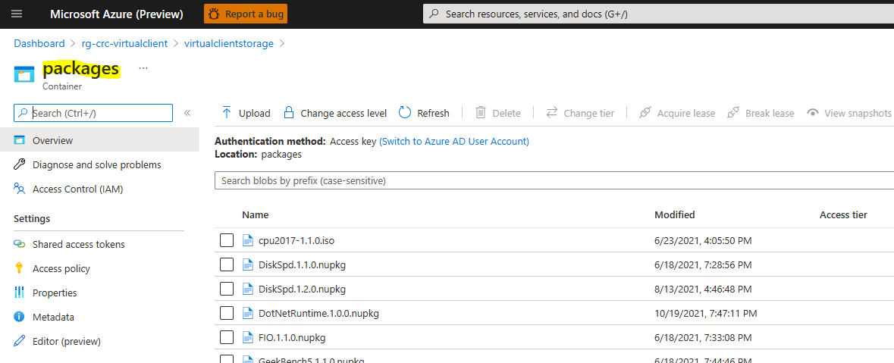
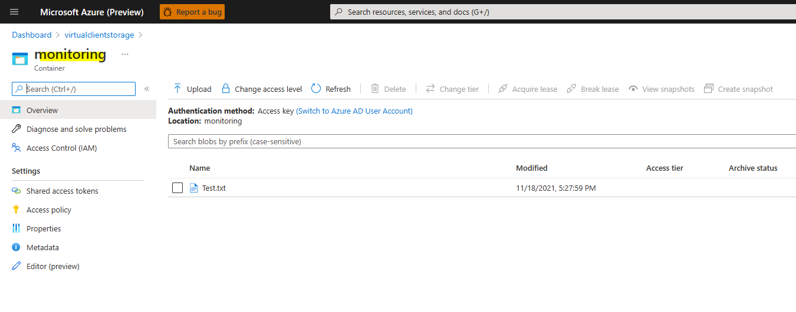
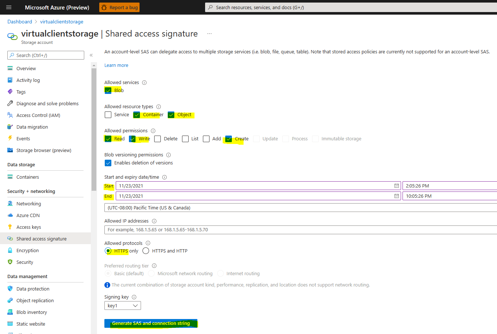
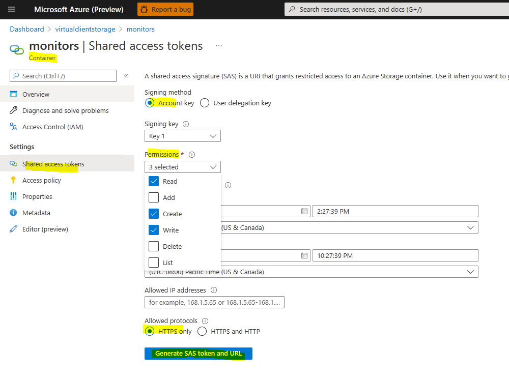

# Azure Storage Account Integration
Virtual Client supports a few different types of Azure Blob stores that can be used as part of a workload profile execution. This documentation
covers how to supply those blob stores to the Virtual Client on the command line as well as how to use them in Virtual Client codebase.
  
## Supported Blob Stores
The following stores are supported by the Virtual Client. The stores must be Azure Storage Account blob stores.

* **Packages Store**  
  The packages blob store contains workload and dependency packages that must be downloaded to a system during the execution of a
  workload profile. These are typically NuGet/zip files that contain binaries, scripts, etc... that are required by the scenario profile.

  The packages store can be supplied to the Virtual Client on the command line using the '--packageStore' parameter and supplying the
  full connection string to the Azure storage account blob resource.

  ``` bash
  # The blob container does not require authentication (i.e. blob-anonymous read access)
  VirtualClient.exe --profile=PERF-NETWORK.json --timeout=1440 --packageStore="https://any.blob.core.windows.net"

  # The blob continer requires authentication (e.g. a SAS token)
  VirtualClient.exe --profile=PERF-NETWORK.json --timeout=1440 --packageStore="https://any.blob.core.windows.net/packages?sp=r&st=2022-05-09T18:31:45Z&se=2030-05-10T02:31:45Z&spr=https&sv=2020-08-04&sr=c&sig=..."
  ```

  

* **Content Store**  
  The content blob store is used for uploading files and content captured by workloads or monitors that run as part of Virtual Client workload
  operations. For example, a monitor might be implemented to upload certain types of logs, bin files or cab files to the specified content blob
  store.

  ```
  # The blob container does not require authentication (i.e. blob-anonymous read access)
  VirtualClient.exe --profile=PERF-NETWORK.json --timeout=1440 --contentStore="https://any.blob.core.windows.net"

  # The blob continer requires authentication (e.g. a SAS token)
  VirtualClient.exe --profile=PERF-NETWORK.json --timeout=1440 --contentStore="https://any.blob.core.windows.net/packages?sp=r&st=2022-05-09T18:31:45Z&se=2030-05-10T02:31:45Z&spr=https&sv=2020-08-04&sr=c&sig=..."
  ```

  

## Authentication Preliminaries
The sections below will reference the use of certificates for authentication with Azure storage account resources. This section describes a
few preliminary expectations to consider when using certificates.

### Referencing Certificates on Linux
Virtual Client is a .NET application. Certificates used on a Linux system must be X.509 certificates containing a private key (e.g. PKCS#12, *.pfx). Additionally, the
certificates must be installed on the system in the expected location for the user in which Virtual Client is running. The following locations
describe where Virtual Client/.NET will search to find certificates.

* **Root**  
  When running the Virtual Client application as root (e.g. sudo ./VirtualClient), the application (.NET) will search for certificates
  in `/root/.dotnet/corefx/cryptography/x509stores/my/` directory location.

* **Specific User**  
  When running the Virtual Client application as a specific user (e.g. /home/\{user\} ./VirtualClient), the application (.NET) will search for certificates
  in `/home/{user}/.dotnet/corefx/cryptography/x509stores/my/` directory location. The directory MUST allow at least read/write access for the user to this directory and the
  certificate files within it or Virtual Client will hit a permissions issue.

  <mark>
  Installation involves simply copying the certificate file (*.pfx) into the directory. In fact, it is generally recommended that certificate files (e.g. *.pfx) be copied into this user-specific
  directory for Virtual Client use cases.
  </mark>

  If you experience a permissions issue when running Virtual Client and trying to access certificates, you can attribute permissions on the
  directory using the following command option:

  ``` bash
  sudo chmod -R 700 /home/{user}/.dotnet/corefx/cryptography/x509stores/my/

  # e.g.
  sudo chmod -R 700 /home/anyuser/.dotnet/corefx/cryptography/x509stores/my/
  ```

### Referencing Certificates on Windows
Virtual Client will look for certificates in the following store locations on Windows systems.

* **CurrentUser/Personal**  
  The personal certificate store for current user logged into the system. This is the first certificate store in which Virtual Client will search for
  certificates.

  <mark>
  It is generally recommended that certificate files (e.g. *.pfx) be installed into this user-specific certificate store for Virtual Client use cases.
  </mark>

* **LocalMachine/Personal**  
  The local machine certificate store for the system. This is the second certificate store in which Virtual Client will search for
  certificates.

## Blob Store Authentication
Virtual Client supports connection string-style as well as URI-style definitions. The the following sections covers authentication options for 
storage account access.

### URI-Style References
The following documentation illustrates how to use URI-style references for accessing storage accounts.

  * **Microsoft Entra ID/App With Certificate (referenced by thumbprint)**  
    The following section shows how to use a Microsoft Entra ID/App and a certificate referenced by its thumbprint to authenticate with Azure storage account resources
    (see the 'Authentication Preliminaries' section above). The following URI query string parameters are required:

    * **crtt**  
      The unique thumbprint (SHA1) of the certificate to use for authentication against the Microsoft Entra ID/App.

    * **cid**  
      The client ID of the Microsoft Entra ID/App to use for authentication against the Azure storage account.

    * **tid**  
      The ID of the Azure tenant/directory in which the Microsoft Entra ID/App exists.

    ``` bash
    # e.g.
    # Given a Microsoft Entra ID/App with the following properties:
    # Application Client ID = 08331e3b-1458-4de2-b1d6-7007bc7221d5
    # Azure Tenant ID       = 573b5dBbe-c477-4a10-8986-a7fe10e2d79B
    #
    # ...and a certificate with the following properties:
    # Certificate Thumbprint = f5b114e61c6a81b40c1e7a5e4d11ac47da6e445f
    
    # Reference certificate by thumbprint
    --packages="https://anystorageaccount.blob.core.windows.net?cid=08331e3b-1458-4de2-b1d6-7007bc7221d5&tid=573b5dBbe-c477-4a10-8986-a7fe10e2d79B&crtt=f5b114e61c6a81b40c1e7a5e4d11ac47da6e445f"
    ```

    The same format can be used to download custom profiles from target Storage Account location.

    ``` bash
    # e.g.
    # Given a Microsoft Entra ID/App with the following properties:
    # Application Client ID = 08331e3b-1458-4de2-b1d6-7007bc7221d5
    # Azure Tenant ID       = 573b5dBbe-c477-4a10-8986-a7fe10e2d79B
    #
    # ...and a certificate with the following properties:
    # Certificate Thumbprint = f5b114e61c6a81b40c1e7a5e4d11ac47da6e445f
    
    # Reference certificate by thumbprint
    --profile="https://anystorageaccount.blob.core.windows.net/profiles/ANY-PROFILE.json?cid=08331e3b-1458-4de2-b1d6-7007bc7221d5&tid=573b5dBbe-c477-4a10-8986-a7fe10e2d79B&crtt=f5b114e61c6a81b40c1e7a5e4d11ac47da6e445f"
    ```

  * **Microsoft Entra ID/App With Certificate (referenced by issuer and subject name)**  
    The following section shows how to use a Microsoft Entra ID/App and a certificate referenced by its issuer and subject name to authenticate with Azure storage account resources
    (see the 'Authentication Preliminaries' section above). The following parameters are required:

    * **crti**  
      The issuer defined in the certificate to use for authentication against the Microsoft Entra ID/App (e.g. CN=ABC CA Authority 01, DC=ABC, DC=COM).

    * **crts**  
      The subject name defined in the certificate to use for authentication against the Microsoft Entra ID/App (e.g. CN=any.domain.com).

    * **cid**  
      The client ID of the Microsoft Entra ID/App to use for authentication against the Azure storage account.

    * **tid**  
      The ID of the Azure tenant/directory in which the Microsoft Entra ID/App exists.

    ``` bash
    # e.g.
    # Given a Microsoft Entra ID/App with the following properties:
    # Application Client ID = 08331e3b-1458-4de2-b1d6-7007bc7221d5
    # Azure Tenant ID       = 573b5dBbe-c477-4a10-8986-a7fe10e2d79B
    #
    # ...and a certificate with the following properties:
    # Certificate Issuer    = CN=ABC CA 01, DC=ABC, DC=COM
    # Certificate Subject   = CN=any.domain.com

    # Reference certificate by issuer and subject
    --packages="https://anystorageaccount.blob.core.windows.net?cid=08331e3b-1458-4de2-b1d6-7007bc7221d5&tid=573b5dBbe-c477-4a10-8986-a7fe10e2d79B&crti=CN=ABC CA 01, DC=ABC, DC=COM&crts=CN=any.domain.com"
    --content="https://anystorageaccount.blob.core.windows.net?cid=08331e3b-1458-4de2-b1d6-7007bc7221d5&tid=573b5dBbe-c477-4a10-8986-a7fe10e2d79B&cri=CN=ABC CA 01, DC=ABC, DC=COM&crs=CN=any.domain.com"

    # Reference parts of the certificate issuer and subject (e.g. COM, ABC, ABC CA 01).
    --packages="https://anystorageaccount.blob.core.windows.net?cid=08331e3b-1458-4de2-b1d6-7007bc7221d5&tid=573b5dBbe-c477-4a10-8986-a7fe10e2d79B&crti=COM&crts=any.domain.com"
    --packages="https://anystorageaccount.blob.core.windows.net?cid=08331e3b-1458-4de2-b1d6-7007bc7221d5&tid=573b5dBbe-c477-4a10-8986-a7fe10e2d79B&crti=ABC&crts=any.domain.com"
    --packages="https://anystorageaccount.blob.core.windows.net?cid=08331e3b-1458-4de2-b1d6-7007bc7221d5&tid=573b5dBbe-c477-4a10-8986-a7fe10e2d79B&crti=ABC CA 01&crts=any.domain.com"
    ```

    The same format can be used to download custom profiles from target Storage Account location.

    ``` bash
    # e.g.
    # Given a Microsoft Entra ID/App with the following properties:
    # Application Client ID = 08331e3b-1458-4de2-b1d6-7007bc7221d5
    # Azure Tenant ID       = 573b5dBbe-c477-4a10-8986-a7fe10e2d79B
    #
    # ...and a certificate with the following properties:
    # Certificate Issuer    = CN=ABC CA 01, DC=ABC, DC=COM
    # Certificate Subject   = CN=any.domain.com

    # Reference certificate by issuer and subject
    --profile="https://anystorageaccount.blob.core.windows.net/profiles/ANY-PROFILE.json?cid=08331e3b-1458-4de2-b1d6-7007bc7221d5&tid=573b5dBbe-c477-4a10-8986-a7fe10e2d79B&crti=CN=ABC CA 01, DC=ABC, DC=COM&crts=CN=any.domain.com"
    --profile="https://anystorageaccount.blob.core.windows.net/profiles/any/virtual/path/ANY-PROFILE.json?cid=08331e3b-1458-4de2-b1d6-7007bc7221d5&tid=573b5dBbe-c477-4a10-8986-a7fe10e2d79B&crti=CN=ABC CA 01, DC=ABC, DC=COM&crts=CN=any.domain.com"
    ```

  * **Microsoft Azure Managed Identity**  
    The following section shows how to use a Microsoft Azure managed identity to authenticate with Azure storage account namespace resources.
    The following parameters are required:

    * **miid**  
      The client ID of the managed identity to use for authentication against the storage account.
    
    ``` bash
    # Given a Microsoft Azure Managed Identity with the following properties:
    # Managed Identity Client ID = 6d3c5db8-e14b-44b7-9887-d168b5f659f6

    --packages="https://anystorageaccount.blob.core.windows.net?miid=6d3c5db8-e14b-44b7-9887-d168b5f659f6"
    ```

    The same format can be used to download custom profiles from target Storage Account location.

    ``` bash
    # Given a Microsoft Azure Managed Identity with the following properties:
    # Managed Identity Client ID = 6d3c5db8-e14b-44b7-9887-d168b5f659f6

    --profile="https://anystorageaccount.blob.core.windows.net/profiles/ANY-PROFILE.json?miid=6d3c5db8-e14b-44b7-9887-d168b5f659f6"
    --profile="https://anystorageaccount.blob.core.windows.net/profiles/any/virtual/path/ANY-PROFILE.json?miid=6d3c5db8-e14b-44b7-9887-d168b5f659f6"
    ```

  * **Storage Account Blob Service SAS URI**  
    This is a SAS URI to the Blob service in the storage account. This provides exactly the same types of privileges as the Blob service-level connection string noted above.

    ``` bash
    --packages="https://anystorageaccount.blob.core.windows.net/?sv=2020-08-04&ss=b&srt=c&sp=rwlacx&se=2021-11-23T14:30:18Z&st=2021-11-23T02:19:18Z&spr=https&sig=jcql6El..."
    ```

    Use the following recommendations when creating shared access keys in the blob store to ensure the right amount of privileges
    are granted to the Virtual Client application for uploading and downloading blobs.

    Select the following options when defining shared access signatures at the Blob service level:
    * Allowed services = Blob
    * Allowed resource types = Container, Object
    * Allowed permissions = Read (allow Write and Create permissions if the storage account will be used for log/content uploads)
    * Allowed protocols = HTTPS only

    

  * **Storage Account Blob Container SAS URI**  
    This is a SAS URI to a single blob container within the storage account. This is the most restrictive way of providing privileges but is also the most secure because it
    provides the least amount of access to the application. This is a good fit for scenarios where all content (e.g. across all monitors) is uploaded to a single container 
    within the blob store.

    * [Shared Access Signatures (SAS) Overview](https://docs.microsoft.com/en-us/azure/storage/common/storage-sas-overview)  
    * [Account Shared Access Signatures](https://docs.microsoft.com/en-us/rest/api/storageservices/create-account-sas?redirectedfrom=MSDN)

    ``` bash
    --packages="https://anystorageaccount.blob.core.windows.net/packages?sp=r&st=2021-11-23T18:22:49Z&se=2021-11-24T02:22:49Z&spr=https&sv=2020-08-04&sr=c&sig=ndyPRH..."
    ```

    The same format can be used to download custom profiles from target Storage Account location.

    ``` bash
    --profile="https://anystorageaccount.blob.core.windows.net/profiles/ANY-PROFILE.json?sp=r&st=2021-11-23T18:22:49Z&se=2021-11-24T02:22:49Z&spr=https&sv=2020-08-04&sr=c&sig=ndyPRH..."
    ```
    
    Select the following options when defining shared access signatures at the Blob container level:
    * Signing method = Account key
    * Permissions = Read (allow Write and Create permissions if the storage account will be used for log/content uploads)
    * Allowed protocols = HTTPS only

    

### Connection String-Style References
The following documentation illustrates how to use connection string-style references for accessing storage accounts.

  * **Microsoft Entra ID/App With Certificate (referenced by thumbprint)**  
    The following section shows how to use a Microsoft Entra ID/App and a certificate referenced by its thumbprint to authenticate with Azure storage account resources
    (see the 'Authentication Preliminaries' section above). The following parameters are required:

    * **CertificateThumbprint**  
      The unique thumbprint (SHA1) of the certificate to use for authentication against the Microsoft Entra ID/App.

    * **ClientId**  
      The client ID of the Microsoft Entra ID/App to use for authentication against the Azure storage account.

    * **TenantId**  
      The ID of the Azure tenant/directory in which the Microsoft Entra ID/App exists.

    * **EndpointUrl**  
      The full URL to the target Azure storage account. Note that the Microsoft Entra ID/App must be given
      appropriate RBAC permissions to the storage account (e.g. Reader and Data Access + Storage Blob Data Reader or Storage Blob Data Contributor).

    ``` bash
    # e.g.
    # Given a Microsoft Entra ID/App with the following properties:
    # Application Client ID = 08331e3b-1458-4de2-b1d6-7007bc7221d5
    # Azure Tenant ID       = 573b5dBbe-c477-4a10-8986-a7fe10e2d79B
    #
    # ...and a certificate with the following properties:
    # Certificate Thumbprint = f5b114e61c6a81b40c1e7a5e4d11ac47da6e445f
    
    # Reference certificate by thumbprint
    --packages="EndpointUrl=https://anystorageaccount.blob.core.windows.net;ClientId=08331e3b-1458-4de2-b1d6-7007bc7221d5;TenantId=573b5dBbe-c477-4a10-8986-a7fe10e2d79B;CertificateThumbprint=f5b114e61c6a81b40c1e7a5e4d11ac47da6e445f"
    ```

    The same format can be used to download custom profiles from target Storage Account location.

    ``` bash
    # e.g.
    # Given a Microsoft Entra ID/App with the following properties:
    # Application Client ID = 08331e3b-1458-4de2-b1d6-7007bc7221d5
    # Azure Tenant ID       = 573b5dBbe-c477-4a10-8986-a7fe10e2d79B
    #
    # ...and a certificate with the following properties:
    # Certificate Thumbprint = f5b114e61c6a81b40c1e7a5e4d11ac47da6e445f
    
    # Reference certificate by thumbprint
    --profile="EndpointUrl=https://anystorageaccount.blob.core.windows.net/profiles/ANY-PROFILE.json;ClientId=08331e3b-1458-4de2-b1d6-7007bc7221d5;TenantId=573b5dBbe-c477-4a10-8986-a7fe10e2d79B;CertificateThumbprint=f5b114e61c6a81b40c1e7a5e4d11ac47da6e445f"
    ```

  * **Microsoft Entra ID/App With Certificate (referenced by issuer and subject name)**  
    The following section shows how to use a Microsoft Entra ID/App and a certificate referenced by its issuer and subject name to authenticate with Azure storage account resources
    (see the 'Authentication Preliminaries' section above). The following parameters are required:

    * **CertificateIssuer**  
      The issuer defined in the certificate to use for authentication against the Microsoft Entra ID/App (e.g. CN=ABC CA Authority 01, DC=ABC, DC=COM).

    * **CertificateSubject**  
      The subject name defined in the certificate to use for authentication against the Microsoft Entra ID/App (e.g. CN=any.domain.com).

    * **ClientId**  
      The client ID of the Microsoft Entra ID/App to use for authentication against the Azure storage account.

    * **TenantId**  
      The ID of the Azure tenant/directory in which the Microsoft Entra ID/App exists.

    * **EndpointUrl**  
      The full URL to the target Azure storage account. Note that the Microsoft Entra ID/App must be given
      appropriate RBAC permissions to the storage account (e.g. Reader and Data Access + Storage Blob Data Reader or Storage Blob Data Contributor).

    ``` bash
    # e.g.
    # Given a Microsoft Entra ID/App with the following properties:
    # Application Client ID = 08331e3b-1458-4de2-b1d6-7007bc7221d5
    # Azure Tenant ID       = 573b5dBbe-c477-4a10-8986-a7fe10e2d79B
    #
    # ...and a certificate with the following properties:
    # Certificate Issuer    = CN=ABC CA Authority 01, DC=ABC, DC=COM
    # Certificate Subject   = CN=any.domain.com

    # Reference certificate by issuer and subject
    --packages="EndpointUrl=https://anystorageaccount.blob.core.windows.net/;ClientId=08331e3b-1458-4de2-b1d6-7007bc7221d5;TenantId=573b5dBbe-c477-4a10-8986-a7fe10e2d79B;CertificateIssuer=CN=ABC CA Authority 01, DC=ABC, DC=COM;CertificateSubject=CN=any.domain.com"
    --content="EndpointUrl=https://anystorageaccount.blob.core.windows.net/;ClientId=08331e3b-1458-4de2-b1d6-7007bc7221d5;TenantId=573b5dBbe-c477-4a10-8986-a7fe10e2d79B;CertificateIssuer=CN=ABC CA Authority 01, DC=ABC, DC=COM;CertificateSubject=CN=any.domain.com"

    # Reference parts of the certificate issuer and subject (e.g. COM, ABC, ABC CA Authority 01).
    --packages="EndpointUrl=https://anystorageaccount.blob.core.windows.net/;ClientId=08331e3b-1458-4de2-b1d6-7007bc7221d5;TenantId=573b5dBbe-c477-4a10-8986-a7fe10e2d79B;CertificateIssuer=COM;CertificateSubject=any.domain.com"
    --packages="EndpointUrl=https://anystorageaccount.blob.core.windows.net/;ClientId=08331e3b-1458-4de2-b1d6-7007bc7221d5;TenantId=573b5dBbe-c477-4a10-8986-a7fe10e2d79B;CertificateIssuer=ABC;CertificateSubject=any.domain.com"
    --packages="EndpointUrl=https://anystorageaccount.blob.core.windows.net/;ClientId=08331e3b-1458-4de2-b1d6-7007bc7221d5;TenantId=573b5dBbe-c477-4a10-8986-a7fe10e2d79B;CertificateIssuer=ABC CA Authority 01;CertificateSubject=any.domain.com"
    ```

    The same format can be used to download custom profiles from target Storage Account location.

    ``` bash
    # e.g.
    # Given a Microsoft Entra ID/App with the following properties:
    # Application Client ID = 08331e3b-1458-4de2-b1d6-7007bc7221d5
    # Azure Tenant ID       = 573b5dBbe-c477-4a10-8986-a7fe10e2d79B
    #
    # ...and a certificate with the following properties:
    # Certificate Issuer    = CN=ABC CA Authority 01, DC=ABC, DC=COM
    # Certificate Subject   = CN=any.domain.com

    # Reference certificate by issuer and subject
    --profile="EndpointUrl=https://anystorageaccount.blob.core.windows.net/profiles/ANY-PROFILE.json;ClientId=08331e3b-1458-4de2-b1d6-7007bc7221d5;TenantId=573b5dBbe-c477-4a10-8986-a7fe10e2d79B;CertificateIssuer=ABC;CertificateSubject=any.domain.com"
    --profile="EndpointUrl=https://anystorageaccount.blob.core.windows.net/profiles/any/virtual/path/ANY-PROFILE.json;ClientId=08331e3b-1458-4de2-b1d6-7007bc7221d5;TenantId=573b5dBbe-c477-4a10-8986-a7fe10e2d79B;CertificateIssuer=ABC;CertificateSubject=any.domain.com"
    ```

  * **Microsoft Azure Managed Identity**  
    The following section shows how to use a Microsoft Azure managed identity to authenticate with Azure storage account namespace resources.
    The following parameters are required:

    * **ManagedIdentityId**  
      The client ID of the managed identity to use for authentication against the storage account.
    
    * **EndpointUrl**  
      The full URL to the target Azure storage account. Note that the managed identity must be given
      appropriate RBAC permissions to the storage account (e.g. Reader and Data Access + Storage Blob Data Reader or Storage Blob Data Contributor).
    
    ``` bash
    # Given a Microsoft Azure Managed Identity with the following properties:
    # Managed Identity ID = 6d3c5db8-e14b-44b7-9887-d168b5f659f6

    --packages="EndpointUrl=https://yourblobstore.blob.core.windows.net/;ManagedIdentityId=6d3c5db8-e14b-44b7-9887-d168b5f659f6"
    ```

    The same format can be used to download custom profiles from target Storage Account location.

    ``` bash
    # Given a Microsoft Azure Managed Identity with the following properties:
    # Managed Identity ID = 6d3c5db8-e14b-44b7-9887-d168b5f659f6

    --profile="EndpointUrl=https://yourblobstore.blob.core.windows.net/profiles/ANY-PROFILE.json;ManagedIdentityId=6d3c5db8-e14b-44b7-9887-d168b5f659f6"
    ```

## Storage Account Blob Conventions for Content/File Uploads
In order to ensure that files/content uploaded (e.g. --content usages) are easy to find in the blob stores, Virtual Client supports defining a flexible blob path template. The virtual path 
location of files/content in the storage account can be defined using the `--contentPathTemplate` command line option.

``` bash
# By default files/content uploaded will be saved to a container whose name matches the experiment ID for
# the Virtual Client run.
#
# However, the location can be explicitly defined using the content path template.
#
# e.g.
./VirtualClient --profile=PERF-CPU-OPENSSL.json ... --contentPathTemplate="{experimentId}/logs/{toolName}/{scenarioName}"
```

In above example, the virtual blob folder structure will have sub-folders corresponding to each element separated by a '/' in the content path template defined.
This template is using different supported template placeholders (e.g. the parts in \{xyz\} brackets). These template placeholder values (e.g. \{experimentId\}, \{scenario\}), 
will be replaced at runtime with appropriate values. Note that the directory path segments in the final virtual path will be entirely lower-cased. Azure storage account blob paths
are case-sensitive. Lower-casing helps to ensure predictability.

``` bash
# e.g.
# 
# Given the following experiment properties:
# Experiment ID = 29be58e5-94de-4703-beab-5c8862abcdAa7
# Tool Name     = OpenSSL
# Scenario Name = MD5
#
# ...and a content path template defined
--contentPathTemplate="{experimentId}/logs/{toolName}/{scenarioName}"

# Files/content would be uploaded to a virtual path in the storage account that looks like the following:
# 29be58e5-94de-4703-beab-5c8862abcdAa7/logs/openssl/md5
```

### Default Content Path Template
If a content path template is not defined explicitly on the command line, the default template will be used. The default template is as follows:

``` bash
# Default content path template
"{experimentId}/{agentId}/{toolName}/{role}/{scenario}"
```

### Well-Known Content Path Template Placeholders
The following section shows the set of supported "well-known" content path template placeholders.

* **\{experimentId\}**  
  The experiment ID for the Virtual Client execution (e.g. ./VirtualClient --profile=PERF-CPU-OPENSSL.json --experimentId=29be58e5-94de-4703-beab-5c8862abcdAa7 --> 29be58e5-94de-4703-beab-5c8862abcdAa7)

* **\{agentId\}**  
  The ID of the Virtual Client instance running (e.g. ./VirtualClient --profile=PERF-CPU-OPENSSL.json --agentId=agent1234 --> agent1234).

* **\{toolName\}**  
  This is the name of the tool/toolset associated with a given workload or monitor (e.g. OpenSSL).

* **\{scenarioName\}**  
  This is the name of the scenario in a profile associated with a given workload or monitor (e.g. MD5, SHA1).

* **\{role\}**  
  The client/server role for the Virtual Client instence (e.g. Client, Server). This is relevant only for profiles that execute workloads across multiple systems.

### Additional Supported Content Path Template Placeholders
In addition to the "well-known" content path template placeholders, the user can define any number of additional values on the command line using either
the `--parameters` or `--metadata` options. The key for any one of the key/value pairs in either of these two command line options can be referenced as
a placeholder in a content path template.

  ``` bash
  # e.g.
  # Suppose a content path template is defined on the command line and it references placeholders for 
  # properties defined/supplied in the --metadata (e.g. environment, audience).
  VirtualClient.exe --profile=PERF-CPU-OPENSSL.json --experimentId=29be58e5-94de-4703-beab-5c8862abcdAa7 --agentId=agent1234 --contentPathTemplate="{environment}/{audience}/{experimentId}/{agentId}/{toolName}/{scenarioName}" --metadata="environment=demo,,,audience=my_team" 

  # The custom placeholders defined in the metadata will be resolved at runtime and replaced
  # in the virtual paths for the blobs/files (e.g. {environment} --> demo, {audience} --> my_team)
  
  # The following shows what the virtual paths might look like.
  demo/my_team/29be58e5-94de-4703-beab-5c8862abcdAa7/agent1234/openssl/md5/2022-03-07T01:32:27.1237655Z-md5.log
  demo/my_team/29be58e5-94de-4703-beab-5c8862abcdAa7/agent1234/openssl/md5/2022-03-07T02:20:45.4673920Z-md5.log
  ```

### Content Upload File Naming Conventions
The following section provides additional context information related to content file uploads.

* **File Naming Conventions**  
  In order to ensure each file within the storage account is unique a timestamp will be added to the name of the file. This helps to avoid collisions in file
  names that could result in a given blob/file being overwritten unexpectedly. Timestamps added to file names will be in "universal round trip" date/time format
  (e.g. monitor.log --> 2023-08-17t0637583781z-monitor.log).

  This is the name of the file as it should be reflected in the blob store. A timestamp (round-trip date/time format) will be added to the beginning of the file name
  (e.g. 2023-08-17t0637583781z-monitor.log). Universal round-trip date/time formats have the additional benefit of being naturally sortable in U/X experiences
  such as a web browser.

  ``` bash
  # e.g.
  # Suppose the following content path template is defined on the command line:
  VirtualClient.exe --profile=PERF-CPU-OPENSSL.json --experimentId=29be58e5-94de-4703-beab-5c8862abcdAa7 --agentId=agent1234 --contentPathTemplate="{environment}/{audience}/{experimentId}/{agentId}/{toolName}/{scenarioName}" --metadata="environment=demo,,,audience=my_team" 

  # The following shows examples of what the virtual paths files uploaded might look like. The blob container
  # is the very first segment in the content path template (e.g. demo).
  demo/my_team/29be58e5-94de-4703-beab-5c8862abcdAa7/agent1234/openssl/md5/2022-03-07T01:32:27.1237655Z-md5.log
  demo/my_team/29be58e5-94de-4703-beab-5c8862abcdAa7/agent1234/openssl/md5/2022-03-07T02:20:45.4673920Z-md5.log
  demo/my_team/29be58e5-94de-4703-beab-5c8862abcdAa7/agent1234/openssl/sha256/2022-03-07T01:40:10.6382906Z-sha256.log
  demo/my_team/29be58e5-94de-4703-beab-5c8862abcdAa7/agent1234/openssl/sha256/2022-03-07T02:56:11.3975286Z-sha256.log
  ```

## Integration with the Development Process
This section describes how access to the supported blob stores can be integrated into the Virtual Client process.

### How Blob Stores are Integrated into Dependencies
When the Virtual Client reads the blob stores (i.e. connection strings) from the command line, it will place a set of
BlobStore objects into the dependencies collection that is passed into the constructors of ALL profile actions, dependencies
and monitors.

``` csharp
// In the CommandBase class in the Main project
List<BlobStore> blobStores = new List<BlobStore>();
if (this.ContentBlobStore != null)
{
    blobStores.Add(this.ContentBlobStore);
}

if (this.PackagesBlobStore != null)
{
    blobStores.Add(this.PackagesBlobStore);
}

IServiceCollection dependencies = new ServiceCollection();
...
dependencies.AddSingleton<IEnumerable<BlobStore>>(blobStores);
```

Each of the BlobStore instances describes a single blob store that can be then used within any of the components described
in the profile. To use upload or download blobs from one of the stores, create a BlobManager instance. The blob manager has
simple download and upload methods available.

[Example Implementation/Usage](https://github.com/microsoft/VirtualClient/blob/main/src/VirtualClient/VirtualClient.Monitors/ExampleMonitorWithBlobUploadIntegration.cs)

``` csharp
// Using the example implementation noted above:
//
// Get the blob store reference and create a BlobManager to upload blobs to the store.
if (this.TryGetContentStore(out BlobStore contentStore))
{
    DateTime snapshotTime = DateTime.UtcNow;
    IBlobManager blobManager = new BlobManager(contentStore.ConnectionString);

    // For this example, assume there is a file that contains the output of some monitoring
    // toolset. We want to upload this file to the content blob store.
    using (FileStream uploadStream = new FileStream(resultsFilePath, FileMode.Open, FileAccess.Read, FileShare.Read))
    {
        BlobDescriptor resultsBlob = new BlobDescriptor
        {
            // For this scenario, we have a folder structure and naming convention for each of the blobs
            // that is specific to the monitor but that also allows for consecutive blobs to be uploaded without
            // overwriting previously uploaded blobs.
            //
            // Example:
            // Given an experiment ID = 24149a49-66c9-4bd1-9332-18370c7c70e1 and an Agent ID = cluster01,cc296787-aee6-4ce4-b814-180627508d12,anyvm-01:
            //
            // Format = 24149a49-66c9-4bd1-9332-18370c7c70e1/cluster01,cc296787-aee6-4ce4-b814-180627508d12,anyvm-01/examplemonitor/2022-03-07T01:32:27.1237655Z-monitor.log
            BlobName = BlobDescriptor.ToPath(this.ExperimentId, this.AgentId, "examplemonitor", "monitor.log"),
            ContainerName = "monitors",
            ContentEncoding = Encoding.UTF8,
            ContentType = "text/plain"
        };

        await blobManager.UploadBlobAsync(resultsBlob, uploadStream, cancellationToken)
            .ConfigureAwait(false);
    }
}
```
