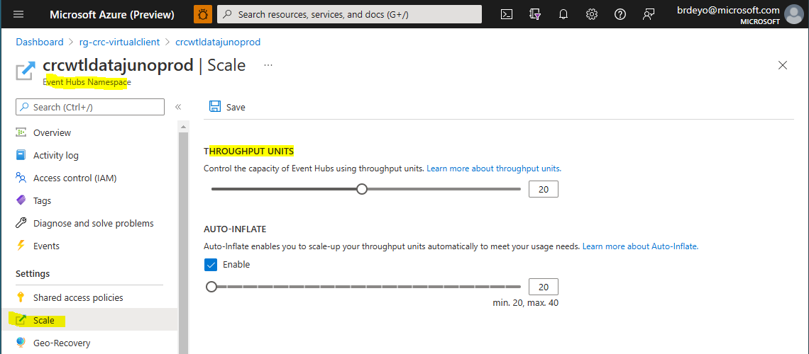
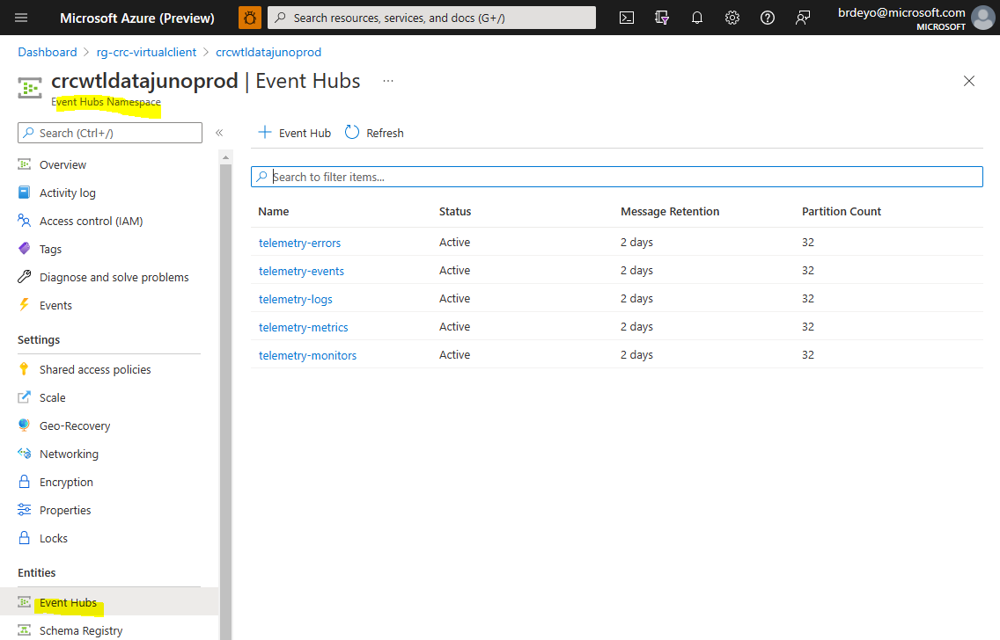

# Azure Event Hub Integration
Azure Event Hubs is a highly scalable Azure cloud messaging hub/proxy that has out-of-the-box integration with a number of other Azure data/data 
pipeline resources (e.g. Azure Data Explorer/Kusto, Azure Storage Account). Virtual Client allows the user to supply a connection string to an Event Hubs namespace on the command line. The remainder of this document 
covers the requirements for using an Event Hub including the setup.

* [Data/Telemetry Basics](./0040-telemetry.md)
* [Event Hub Documentation](https://azure.microsoft.com/en-us/services/event-hubs/?OCID=AID2200277_SEM_e21e0a74b99318c95ac66be89b11ec19:G:s&ef_id=e21e0a74b99318c95ac66be89b11ec19:G:s&msclkid=e21e0a74b99318c95ac66be89b11ec19)

## Event Hubs integration
Event Hub is a highly scalable Azure cloud messaging hub/proxy that has out-of-the-box integration with a number of other Azure data/data 
pipeline resources (e.g. Azure Data Explorer/Kusto, Azure Storage Account). Virtual Client allows the user to supply a connection string to an Event Hubs namespace on the command line. The remainder of this document 
covers the requirements for using an Event Hub including the setup.

## Authentication Preliminaries
The sections below will reference the use of certificates for authentication with Azure storage account resources. This section describes a
few preliminary expectations to consider when using certificates.

### Referencing Certificates on Linux
Virtual Client is a .NET application. Certificates used on a Linux system must be X.509 certificates containing a private key (e.g. PKCS#12, *.pfx). Additionally, the
certificates must be installed on the system in the expected location for the user in which Virtual Client is running. The following locations
describe where Virtual Client/.NET will search to find certificates.

* **Root**  
  When running the Virtual Client application as root (e.g. sudo ./VirtualClient), the application (.NET) will search for certificates
  in `/root/.dotnet/corefx/cryptography/x509stores/my/` directory location.

* **Specific User**  
  When running the Virtual Client application as a specific user (e.g. /home/\{user\} ./VirtualClient), the application (.NET) will search for certificates
  in `/home/{user}/.dotnet/corefx/cryptography/x509stores/my/` directory location. The directory MUST allow at least read/write access for the user to this directory and the
  certificate files within it or Virtual Client will hit a permissions issue.

  <mark>
  Installation involves simply copying the certificate file (*.pfx) into the directory. In fact, it is generally recommended that certificate files (e.g. *.pfx) be copied into this user-specific
  directory for Virtual Client use cases.
  </mark>

  If you experience a permissions issue when running Virtual Client and trying to access certificates, you can attribute permissions on the
  directory using the following command option:

  ``` bash
  sudo chmod -R 700 /home/{user}/.dotnet/corefx/cryptography/x509stores/my/

  # e.g.
  sudo chmod -R 700 /home/anyuser/.dotnet/corefx/cryptography/x509stores/my/
  ```

### Referencing Certificates on Windows
Virtual Client will look for certificates in the following store locations on Windows systems.

* **CurrentUser/Personal**  
  The personal certificate store for current user logged into the system. This is the first certificate store in which Virtual Client will search for
  certificates.

  <mark>
  It is generally recommended that certificate files (e.g. *.pfx) be installed into this user-specific certificate store for Virtual Client use cases.
  </mark>

* **LocalMachine/Personal**  
  The local machine certificate store for the system. This is the second certificate store in which Virtual Client will search for
  certificates.

## Event Hubs Authentication
Virtual Client supports connection string-style as well as URI-style definitions. The the following sections covers authentication options for 
Azure Event Hub namespace access.

### URI-Style References
The following documentation illustrates how to use URI-style references for accessing Event Hub namespaces.

  * **Microsoft Entra ID/App With Certificate (referenced by thumbprint)**  
    The following section shows how to use a Microsoft Entra ID/App and a certificate referenced by its thumbprint to authenticate with Azure Event Hub resources
    (see the 'Authentication Preliminaries' section above). The following URI query string parameters are required:

    * **crtt**  
      The unique thumbprint (SHA1) of the certificate to use for authentication against the Microsoft Entra ID/App.

    * **cid**  
      The client ID of the Microsoft Entra ID/App to use for authentication against the Azure Event Hub namespace.

    * **tid**  
      The ID of the Azure tenant/directory in which the Microsoft Entra ID/App exists.

    ``` bash
    # e.g.
    # Given a Microsoft Entra ID/App with the following properties:
    # Application Client ID = 08331e3b-1458-4de2-b1d6-7007bc7221d5
    # Azure Tenant ID       = 573b5dBbe-c477-4a10-8986-a7fe10e2d79B
    #
    # ...and a certificate with the following properties:
    # Certificate Thumbprint = f5b114e61c6a81b40c1e7a5e4d11ac47da6e445f
    
    # Reference certificate by thumbprint
    --eventHub="sb://any.servicebus.windows.net?cid=08331e3b-1458-4de2-b1d6-7007bc7221d5&tid=573b5dBbe-c477-4a10-8986-a7fe10e2d79B&crtt=f5b114e61c6a81b40c1e7a5e4d11ac47da6e445f"
    ```

  * **Microsoft Entra ID/App With Certificate (referenced by issuer and subject name)**  
    The following section shows how to use a Microsoft Entra ID/App and a certificate referenced by its issuer and subject name to authenticate with Azure Event Hub resources
    (see the 'Authentication Preliminaries' section above). The following parameters are required:

    * **crti**  
      The issuer defined in the certificate to use for authentication against the Microsoft Entra ID/App (e.g. CN=ABC CA 01, DC=ABC, DC=COM).

    * **crts**  
      The subject name defined in the certificate to use for authentication against the Microsoft Entra ID/App (e.g. CN=any.domain.com).

    * **cid**  
      The client ID of the Microsoft Entra ID/App to use for authentication against the Azure Event Hub namespace.

    * **tid**  
      The ID of the Azure tenant/directory in which the Microsoft Entra ID/App exists.

    ``` bash
    # e.g.
    # Given a Microsoft Entra ID/App with the following properties:
    # Application Client ID = 08331e3b-1458-4de2-b1d6-7007bc7221d5
    # Azure Tenant ID       = 573b5dBbe-c477-4a10-8986-a7fe10e2d79B
    #
    # ...and a certificate with the following properties:
    # Certificate Issuer    = CN=ABC CA 01, DC=ABC, DC=COM
    # Certificate Subject   = CN=any.domain.com

    # Reference certificate by issuer and subject
    --eventHub="sb://any.servicebus.windows.net?cid=08331e3b-1458-4de2-b1d6-7007bc7221d5&tid=573b5dBbe-c477-4a10-8986-a7fe10e2d79B&crti=CN=ABC CA 01, DC=ABC, DC=COM&crts=CN=any.domain.com"

    # Reference parts of the certificate issuer and subject (e.g. COM, ABC, ABC CA 01).
    --eventHub="sb://any.servicebus.windows.net?cid=08331e3b-1458-4de2-b1d6-7007bc7221d5&tid=573b5dBbe-c477-4a10-8986-a7fe10e2d79B&crti=COM&crts=any.domain.com"
    --eventHub="sb://any.servicebus.windows.net?cid=08331e3b-1458-4de2-b1d6-7007bc7221d5&tid=573b5dBbe-c477-4a10-8986-a7fe10e2d79B&crti=ABC&crts=any.domain.com"
    --eventHub="sb://any.servicebus.windows.net?cid=08331e3b-1458-4de2-b1d6-7007bc7221d5&tid=573b5dBbe-c477-4a10-8986-a7fe10e2d79B&crti=ABC CA 01&crts=any.domain.com"
    ```

  * **Microsoft Azure Managed Identity**  
    The following section shows how to use a Microsoft Azure managed identity to authenticate with Azure Event Hub namespace resources.
    The following parameters are required:

    * **miid**  
      The client ID of the managed identity to use for authentication against the storage account.
    
    ``` bash
    # Given a Microsoft Azure Managed Identity with the following properties:
    # Managed Identity Client ID = 6d3c5db8-e14b-44b7-9887-d168b5f659f6

    --packages="sb://any.servicebus.windows.net?miid=6d3c5db8-e14b-44b7-9887-d168b5f659f6"
    ```

### Connection String-Style References
The following documentation illustrates how to use connection string-style references for accessing Event Hub namespaces.

  * **Microsoft Entra ID/App With Certificate (referenced by thumbprint)**  
    The following section shows how to use a Microsoft Entra ID/App and a certificate referenced by its thumbprint to authenticate with Event Hub namespace resources
    (see the 'Authentication Preliminaries' section above). The following parameters are required:

    * **CertificateThumbprint**  
      The unique thumbprint (SHA1) of the certificate to use for authentication against the Microsoft Entra ID/App.

    * **ClientId**  
      The client ID of the Microsoft Entra ID/App to use for authentication against the Azure Event Hub namespace.

    * **TenantId**  
      The ID of the Azure tenant/directory in which the Microsoft Entra ID/App exists.

    * **EventHubNamespace**  
      The Event Hub namespace to which the telemetry will be sent. Note that the Microsoft Entra ID/App must be given
      appropriate RBAC permissions to the Event Hub namespace (e.g. Azure Event Hubs Data Sender).

    ``` bash
    # Given a Microsoft Entra ID/App with the following properties:
    # Application Client ID  = 08331e3b-1458-4de2-b1d6-7007bc7221d5
    # Azure Tenant ID        = 573b5dBbe-c477-4a10-8986-a7fe10e2d79B
    #
    # ...and a certificate with the following properties:
    # Certificate Thumbprint = f5b114e61c6a81b40c1e7a5e4d11ac47da6e445f

    # Reference certificate by thumbprint
    --eventhub="EndpointUrl=sb://any.servicebus.windows.net;ClientId=08331e3b-1458-4de2-b1d6-7007bc7221d5;TenantId=573b5dBbe-c477-4a10-8986-a7fe10e2d79B;CertificateThumbprint=f5b114e61c6a81b40c1e7a5e4d11ac47da6e445f"
    ```

  * **Microsoft Entra ID/App With Certificate (referenced by issuer and subject name)**  
    The following section shows how to use a Microsoft Entra ID/App and a certificate referenced by its issuer and subject name to authenticate with Event Hub namespace resources
    (see the 'Authentication Preliminaries' section above). The following parameters are required:

    * **CertificateIssuer**  
      The issuer defined in the certificate to use for authentication against the Microsoft Entra ID/App (e.g. CN=ABC CA 01, DC=ABC, DC=COM).

    * **CertificateSubject**  
      The subject name defined in the certificate to use for authentication against the Microsoft Entra ID/App (e.g. CN=any.domain.com).

    * **ClientId**  
      The client ID of the Microsoft Entra ID/App to use for authentication against the Azure Event Hub namespace.

    * **TenantId**  
      The ID of the Azure tenant/directory in which the Microsoft Entra ID/App exists.

    * **EventHubNamespace**  
      The Event Hub namespace to which the telemetry will be sent. Note that the Microsoft Entra ID/App must be given
      appropriate RBAC permissions to the Event Hub namespace (e.g. Azure Event Hubs Data Sender).

    ``` bash
    # Given a Microsoft Entra ID/App with the following properties:
    # Application Client ID = 08331e3b-1458-4de2-b1d6-7007bc7221d5
    # Azure Tenant ID       = 573b5dBbe-c477-4a10-8986-a7fe10e2d79B
    #
    # ...and a certificate with the following properties:
    # Certificate Issuer    = CN=ABC CA Authority 01, DC=ABC, DC=COM
    # Certificate Subject   = CN=any.domain.com
    
    # Reference certificate by issuer and subject
    --eventhub="EndpointUrl=sb://any.servicebus.windows.net;CertificateIssuer=CN=ABC CA 01, DC=ABC, DC=COM;CertificateSubject=CN=any.domain.com"

    # Reference parts of the certificate issuer and subject (e.g. COM, ABC, ABC CA 01).
    --eventhub="EndpointUrl=sb://any.servicebus.windows.net;ClientId=08331e3b-1458-4de2-b1d6-7007bc7221d5;TenantId=573b5dBbe-c477-4a10-8986-a7fe10e2d79B;CertificateIssuer=COM;CertificateSubject=any.domain.com"
    --eventhub="EndpointUrl=sb://any.servicebus.windows.net;ClientId=08331e3b-1458-4de2-b1d6-7007bc7221d5;TenantId=573b5dBbe-c477-4a10-8986-a7fe10e2d79B;CertificateIssuer=ABC;CertificateSubject=any.domain.com"
    --eventhub="EndpointUrl=sb://any.servicebus.windows.net;ClientId=08331e3b-1458-4de2-b1d6-7007bc7221d5;TenantId=573b5dBbe-c477-4a10-8986-a7fe10e2d79B;CertificateIssuer=ABC CA 01;CertificateSubject=any.domain.com"
    ```

  * **Microsoft Azure Managed Identity**  
    The following section shows how to use a Microsoft Azure managed identity to authenticate with Azure Event Hub namespace resources.
    The following parameters are required:

    * **ManagedIdentityId**  
      The client ID of the managed identity to use for authentication against the Event Hub namespace.
    
    * **EventHubNamespace**  
      The Event Hub namespace to which the telemetry will be sent. Note that the managed identity must be given
      appropriate RBAC permissions to the Event Hub namespace (e.g. Azure Event Hubs Data Sender).
    
    ``` bash
    # Given a Microsoft Azure Managed Identity with the following properties:
    # Managed Identity ID = 6d3c5db8-e14b-44b7-9887-d168b5f659f6

    --eventhub="EndpointUrl=sb://any.servicebus.windows.net;ManagedIdentityId=6d3c5db8-e14b-44b7-9887-d168b5f659f6"
    ```

  * **Event Hub Namespace Shared Access Policies**  
    The following section shows how to use an Event Hub Shared Access Policy (i.e. connection string) to authenticate with Azure Event Hub namespace resources.
    The following parameters are required:

    https://learn.microsoft.com/en-us/azure/event-hubs/event-hubs-get-connection-string

    ``` bash
    --eventHub="Endpoint=sb://aaa.servicebus.windows.net/;SharedAccessKeyName=TelemetrySharedAccessKey;SharedAccessKey=bbbbbbbbbb..."
    ```

### Create Event Hub Namespace
The Virtual Client emits data for each one of these categories into a distinct/singular target Event Hub within an Event Hub namespace (a 1-to-1 mapping).
In order to use Event Hub with the Virtual Client, an Event Hub namespace must be setup. The following recommendations relate to the Event Hub namespace itself.

  * **Throughput Units**  
  Throughput units control the capacity for each individual Event Hub created in the namespace. It is recommended that you set this
  to at least 20 for production scenarios. For non-production scale scenarios, this can be set to between 5 and 10. Fortunately, this
  setting can be changed at any point to enable the Event Hubs in the namespace to handle additional message volume.

### Create Event Hubs
The Event Hub namespace will need 4 Event Hubs to be created. The following steps describe requirements and recommendations. These are general recommendations 
based upon the VC team's experience that are designed to support high volumes of telemetry (e.g. hundreds of millions of events per day per hub).

* **telemetry-events**  
  Create an Event Hub named 'telemetry-events' to intake system events data emitted by the Virtual Client. The following specifications should be used when creating
  this Event Hub.
  * Message Retention: 2 days
  * Partition Count: Production Scale = 32, Non-Production/Test Scale = 10

* **telemetry-logs**  
  Create an Event Hub named 'telemetry-logs' to intake logs/traces data emitted by the Virtual Client. The following specifications should be used when creating
  this Event Hub.
  * Message Retention: 2 days
  * Partition Count: Production Scale = 32, Non-Production/Test Scale = 10

* **telemetry-metrics**  
  Create an Event Hub named 'telemetry-metrics' to intake workload metrics/measurements data emitted by the Virtual Client. The following specifications should be used when creating
  this Event Hub.
  * Message Retention: 2 days
  * Partition Count: Production Scale = 32, Non-Production/Test Scale = 10

  
  

## Event Hubs and Azure Data Explorer integration
The following section describes how to setup an existing Azure Data Explorer (ADX) cluster to support ingesting Virtual Client data/telemetry
from the set of Event Hubs describe above. Azure Data Explorer has out-of-box support for defining "data connectors" that will handle the ingestion
of the data on a rapid cadence with little to no data loss. The data from Virtual Client will be ingested into tables within the ADX cluster in a 1-to-1 
mapping with the Event Hubs noted above.

### Create Event Hub Consumer Groups
On each of the Event Hubs created/noted above (e.g. telemetry-logs, telemetry-metrics) in the Event Hub namespace, create a consumer group named
'adx-ingestion'. This consumer group will be used exclusively by the ADX data connectors described below to ingest data from the Event Hubs
into the ADX cluster database tables.

### Create Databases and Tables
The following steps describe the databases and tables required.

  * **Create a Database for Logs/Traces Data**  
    Create a database to host tables that maintain logs/traces data. Data retention periods are defined at the database level in Azure Data Explorer. 
    Virtual Client logs/traces data is useful for debugging necessities but not typically needed to be kept for very long periods of time (vs. performance and monitoring)
    data. Set the data retention period to a value that makes sense for your process. For example, the VC team maintains logs/traces data for 30 days.
    You can name the database whatever you like. The VC team uses the name 'WorkloadDiagnostics' for this database.

  * **Add Managed Identity to the 'Database Ingestor' Role**  
    Add the managed identity created above to the access permissions for the ADX/Kusto database in which the tables below will be created with the
    role 'Database Ingestor'.

  * **Create the Tables for Logs/Traces Data**  
    Data retention periods are defined at the database level in Azure Data Explorer. As such, a different database should be used to host this data
    versus the database used to host performance and monitoring data. Set the data retention period to a value that makes sense for your process. 
    For example, the VC team maintains logs/traces data for 30 days.

    Run the following Kusto Query Language (KQL) commands to create the tables required for ingesting Virtual Client data. 

    ``` kusto
    // Create the table for capturing traces/logs/errors
    .create table Traces (
        Timestamp: datetime,
        ExperimentId: string,
        ClientId: string,
        Profile: string,
        ProfileName: string,
        Message: string,
        SeverityLevel: int,
        ItemType: string,
        ExecutionSystem: string,
        OperatingSystemPlatform: string, 
        OperationId: string,
        OperationParentId: string,
        AppName: string,
        AppHost: string,
        AppVersion: string,
        AppTelemetryVersion: string,
        CustomDimensions: dynamic
    )
    ```

  * **Create a Database for Performance and Monitoring Data**  
    Create a database to host tables that maintain performance and monitoring data. This data is useful for analyzing the performance of the system as well
    as resource usage and is typically desirable to keep for a longer period of time. Set the data retention period to a value that makes sense for your process. For example, 
    the VC team maintains performance and monitoring data for 10 years/3,650 days. You can name the database whatever you like. The VC team uses the name 'WorkloadPerformance' 
    for this database.

  * **Add Managed Identity to the 'Database Ingestor' Role**  
    Add the managed identity created above to the access permissions for the ADX/Kusto database in which the tables below will be created with the
    role 'Database Ingestor'.

  * **Create the Tables for Performance and Monitoring Data**  
    As noted above, it is typically desirable to maintain . Performance and monitoring data are useful over long periods of time
    to analyze historical trends. 

    Run the following Kusto Query Language (KQL) commands to create the tables required for ingesting Virtual Client data.

    ``` kusto
    // Create the table that will maintain important system events information.
    .create table Events (
        Timestamp: datetime,
        ExperimentId: string,
        ClientId: string,
        Profile: string,
        ProfileName: string,
        EventType: string,
        EventInfo: dynamic,
        SeverityLevel: int,
        ItemType: string,
        ExecutionSystem: string,
        OperatingSystemPlatform: string,
        OperationId: string,
        OperationParentId: string,
        AppName: string,
        AppHost: string,
        AppVersion: string,
        AppTelemetryVersion: string,
        Tags: string,
        CustomDimensions: dynamic
    )

    // Create the table to maintain workload and system metrics/counters.
    .create table Metrics (
        Timestamp: datetime,
        ExperimentId: string,
        ClientId: string,
        Profile: string,
        ProfileName: string,
        ToolName: string,
        ScenarioName: string,
        ScenarioStartTime: datetime,
        ScenarioEndTime: datetime,
        MetricCategorization: string,
        MetricName: string,
        MetricValue: real,
        MetricUnit: string,
        ExecutionSystem: string,
        OperatingSystemPlatform: string,
        OperationId: string,
        OperationParentId: string,
        AppName: string,
        AppHost: string,
        AppVersion: string,
        AppTelemetryVersion: string,
        Tags: string,
        CustomDimensions: dynamic
    )
    ```

### Create the JSON Ingestion Mappings
JSON ingestion mappings define how to map the information in the structure of the events on the Event Hub with the table columns in the
ADX databases. 

* **Create the Ingestion Mappings for the Logs/Traces Data**  
  Run the following Kusto Query Language (KQL) commands to create the JSON ingestion mappings required for ingesting Virtual Client logs/traces data.

  ``` kusto
  // 1) Create the ingestion mappings for the 'Traces' table
  .create table Traces ingestion json mapping 'IngestionMapping' '[{"column":"Timestamp","path":"$.timestamp","datatype":"","transform":null},{"column":"ExperimentId","path":"$.customDimensions.experimentId","datatype":"","transform":null},{"column":"ClientId","path":"$.customDimensions.metadata.agentId","datatype":"","transform":null},{"column":"Profile","path":"$.customDimensions.executionProfile","datatype":"","transform":null},{"column":"ProfileName","path":"$.customDimensions.executionProfileName","datatype":"","transform":null},{"column":"Message","path":"$.message","datatype":"","transform":null},{"column":"SeverityLevel","path":"$.severityLevel","datatype":"","transform":null},{"column":"ItemType","path":"$.itemType","datatype":"","transform":null},{"column":"ExecutionSystem","path":"$.customDimensions.executionSystem","datatype":"","transform":null},{"column":"OperatingSystemPlatform","path":"$.customDimensions.operatingSystemPlatform","datatype":"","transform":null},{"column":"OperationId","path":"$.operation_Id","datatype":"","transform":null},{"column":"OperationParentId","path":"$.operation_ParentId","datatype":"","transform":null},{"column":"AppName","path":"$.appName","datatype":"","transform":null},{"column":"AppHost","path":"$.appHost","datatype":"","transform":null},{"column":"AppVersion","path":"$.customDimensions.appVersion","datatype":"","transform":null},{"column":"AppTelemetryVersion","path":"$.sdkVersion","datatype":"","transform":null},{"column":"CustomDimensions","path":"$.customDimensions","datatype":"","transform":null}]'
  ```

* **Create the Ingestion Mappings for the Performance and Monitoring Data**  
  Run the following Kusto Query Language (KQL) commands to create the JSON ingestion mappings required for ingesting Virtual Client performance and monitoring data.

  ``` kusto
  // 1) Create the ingestion mappings for the 'Events' table
  .create table Events ingestion json mapping 'IngestionMapping' '[{"column":"Timestamp","path":"$.timestamp","datatype":"","transform":null},{"column":"ExperimentId","path":"$.customDimensions.experimentId","datatype":"","transform":null},{"column":"ClientId","path":"$.customDimensions.metadata.agentId","datatype":"","transform":null},{"column":"Profile","path":"$.customDimensions.executionProfile","datatype":"","transform":null},{"column":"ProfileName","path":"$.customDimensions.executionProfileName","datatype":"","transform":null},{"column":"EventType","path":"$.customDimensions.eventType","datatype":"","transform":null},{"column":"EventInfo","path":"$.customDimensions.eventInfo","datatype":"","transform":null},{"column":"SeverityLevel","path":"$.severityLevel","datatype":"","transform":null},{"column":"ItemType","path":"$.itemType","datatype":"","transform":null},{"column":"ExecutionSystem","path":"$.customDimensions.executionSystem","datatype":"","transform":null},{"column":"OperatingSystemPlatform","path":"$.customDimensions.operatingSystemPlatform","datatype":"","transform":null},{"column":"OperationId","path":"$.operation_Id","datatype":"","transform":null},{"column":"OperationParentId","path":"$.operation_ParentId","datatype":"","transform":null},{"column":"AppName","path":"$.appName","datatype":"","transform":null},{"column":"AppHost","path":"$.appHost","datatype":"","transform":null},{"column":"AppVersion","path":"$.customDimensions.appVersion","datatype":"","transform":null},{"column":"AppTelemetryVersion","path":"$.sdkVersion","datatype":"","transform":null},{"column":"Tags","path":"$.customDimensions.tags","datatype":"","transform":null},{"column":"CustomDimensions","path":"$.customDimensions","datatype":"","transform":null}]'

  // 2) Create the ingestion mappings for the 'Metrics' table
  .create table Metrics ingestion json mapping 'IngestionMapping' '[{"column":"Timestamp","path":"$.timestamp","datatype":"","transform":null},{"column":"ExperimentId","path":"$.customDimensions.experimentId","datatype":"","transform":null},{"column":"ClientId","path":"$.customDimensions.metadata.agentId","datatype":"","transform":null},{"column":"Profile","path":"$.customDimensions.executionProfile","datatype":"","transform":null},{"column":"ProfileName","path":"$.customDimensions.executionProfileName","datatype":"","transform":null},{"column":"ToolName","path":"$.customDimensions.toolName","datatype":"","transform":null},{"column":"ScenarioName","path":"$.customDimensions.scenarioName","datatype":"","transform":null},{"column":"ScenarioStartTime","path":"$.customDimensions.scenarioStartTime","datatype":"","transform":null},{"column":"ScenarioEndTime","path":"$.customDimensions.scenarioEndTime","datatype":"","transform":null},{"column":"MetricCategorization","path":"$.customDimensions.metricCategorization","datatype":"","transform":null},{"column":"MetricName","path":"$.customDimensions.metricName","datatype":"","transform":null},{"column":"MetricValue","path":"$.customDimensions.metricValue","datatype":"","transform":null},{"column":"MetricUnit","path":"$.customDimensions.metricUnit","datatype":"","transform":null},{"column":"ExecutionSystem","path":"$.customDimensions.executionSystem","datatype":"","transform":null},{"column":"OperatingSystemPlatform","path":"$.customDimensions.operatingSystemPlatform","datatype":"","transform":null},{"column":"OperationId","path":"$.operation_Id","datatype":"","transform":null},{"column":"OperationParentId","path":"$.operation_ParentId","datatype":"","transform":null},{"column":"AppName","path":"$.appName","datatype":"","transform":null},{"column":"AppHost","path":"$.appHost","datatype":"","transform":null},{"column":"AppVersion","path":"$.customDimensions.appVersion","datatype":"","transform":null},{"column":"AppTelemetryVersion","path":"$.sdkVersion","datatype":"","transform":null},{"column":"Tags","path":"$.customDimensions.tags","datatype":"","transform":null},{"column":"CustomDimensions","path":"$.customDimensions","datatype":"","transform":null}]'
  ```

### Create Data Connectors
The following steps describe the data connectors required to ingest data from the Event Hubs into the ADX tables.

* **Create Data Connector for Events Data**  
  This data connector ingests data from the 'telemetry-events' Event Hub into the VirtualClientEvents table. Use the following
  settings during the creation of the data connector after you have selected the appropriate Event Hub information:
  * Event Hub = telemetry-events
  * Consumer group = adx-ingestion
  * Event system properties = 0/none
  * Compression = None
  * Assign managed identity = (the managed identity created above)
  * Table Name = Events (or whatever name was used above when creating the table)
  * Data format = JSON
  * Mapping name = IngestionMapping (or whatever name was used above when creating the ingestion JSON mapping)

* **Create Data Connector for Logs/Traces Data**  
  This data connector ingests data from the 'telemetry-logs' Event Hub into the VirtualClientLogs table. Use the following
  settings during the creation of the data connector after you have selected the appropriate Event Hub information:
  * Event Hub = telemetry-logs
  * Consumer group = adx-ingestion
  * Event system properties = 0/none
  * Compression = None
  * Assign managed identity = (the managed identity created above)
  * Table Name = Traces (or whatever name was used above when creating the table)
  * Data format = JSON
  * Mapping name = IngestionMapping (or whatever name was used above when creating the ingestion JSON mapping)

* **Create Data Connector for Metrics Data**  
  This data connector ingests data from the 'telemetry-metrics' Event Hub into the VirtualClientMetrics table. Use the following
  settings during the creation of the data connector after you have selected the appropriate Event Hub information:
  * Event Hub = telemetry-metrics
  * Consumer group = adx-ingestion
  * Event system properties = 0/none
  * Compression = None
  * Assign managed identity = (the managed identity created above)
  * Table Name = Metrics (or whatever name was used above when creating the table)
  * Data format = JSON
  * Mapping name = IngestionMapping (or whatever name was used above when creating the ingestion JSON mapping)

### Configure ADX Cluster Ingestion Settings
The following steps configure the Azure Data Explorer (ADX) cluster data ingestion settings.

* **Configure the Ingestion Cadence**  
  Run the following command against the ADX cluster to configure how often the data ingestion jobs will run. ADX/Kusto can ingest
  data in near-realtime intervals.

  https://docs.microsoft.com/en-us/azure/data-explorer/kusto/management/batchingpolicy

  ``` kusto 
  // Update the ingestion batching policies on each of the databases. This updates the cadence for ingesting data 
  // to be every 1 minute.
  .alter database {DatabaseName} policy ingestionbatching @"{ 'MaximumBatchingTimeSpan': '00:01:00', 'MaximumNumberOfItems': 500, 'MaximumRawDataSizeMB': 1024 }"

  // View the ingestion batching policy
  .show database {DatabaseName} policy ingestionbatching
  ```